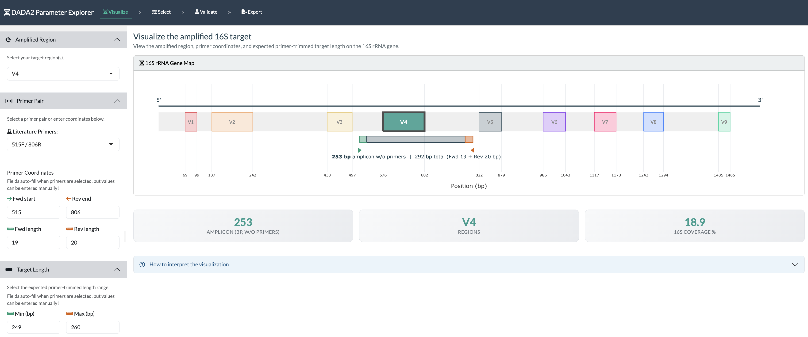
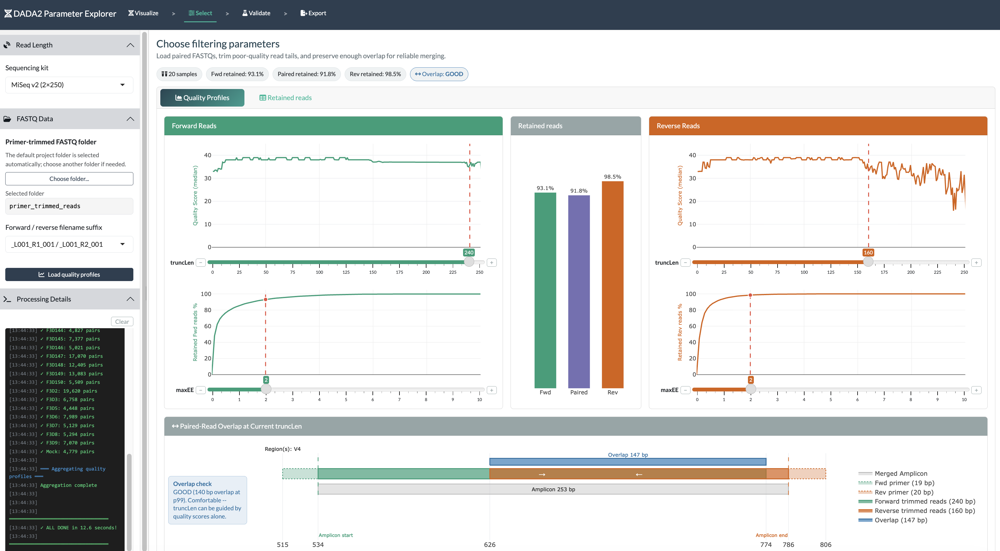
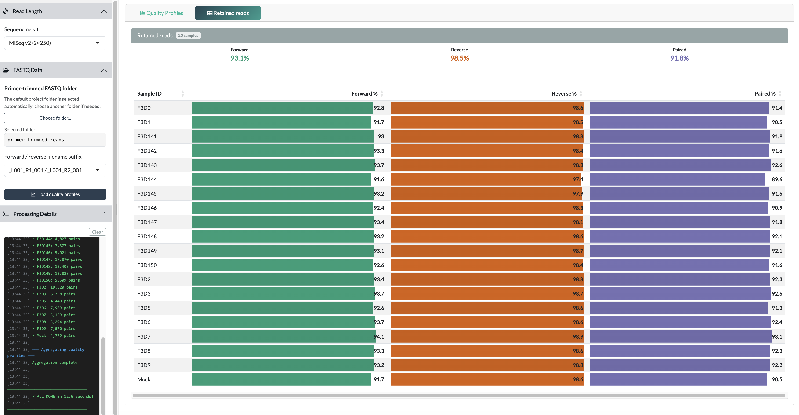
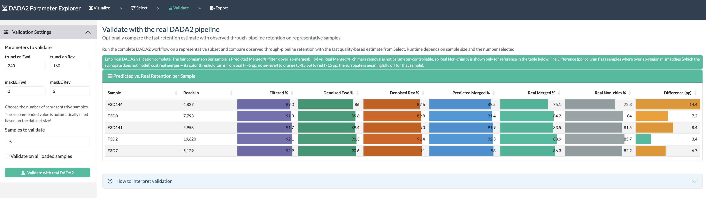
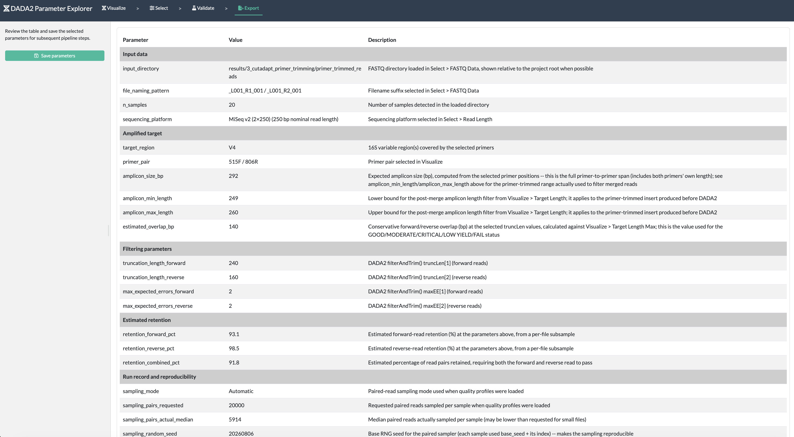

```{r setup, include=FALSE}
# This document is a guide rather than a processing notebook. Code is not
# evaluated by default so knitting it cannot alter pipeline outputs or launch
# a Shiny process that never returns.
knitr::opts_chunk$set(
  eval = FALSE,
  echo = TRUE,
  message = FALSE,
  warning = FALSE
)
```

```{css custom-styles, echo=FALSE, eval=knitr::is_html_output()}
body {
  font-size: 16px;
  line-height: 1.6;
}

h1, h2, h3 {
  color: #2c3e50;
  margin-top: 1.5em;
}

code {
  background-color: #F2F2F2;
  color: #2c3e50;
  padding: 2px 6px;
  border-radius: 3px;
  font-size: 14px;
}

pre, pre code {
  font-size: 14px;
}

.alert-info {
  background-color: #2c3e50;
  color: #ffffff;
  border-left: 4px solid #f39c12;
  padding: 12px;
  margin: 15px 0;
}

.alert-warning {
  background-color: #2c3e50;
  color: #ffffff;
  border-left: 4px solid #e74c3c;
  padding: 12px;
  margin: 15px 0;
}

.alert-success {
  background-color: #d4edda;
  color: #155724;
  border-left: 4px solid #28a745;
  padding: 12px;
  margin: 15px 0;
}

table {
  width: 100%;
}

th, td {
  white-space: normal;
  word-wrap: break-word;
  overflow-wrap: break-word;
  vertical-align: top;
}

.table-scroll {
  width: 100%;
  overflow-x: auto;
  margin: 1em 0;
}

.table-scroll table {
  min-width: 1500px;
  font-size: 13px;
}

img {
  max-width: 100%;
  border: 1px solid #b0b8c1;
  border-radius: 4px;
  padding: 4px;
  background-color: #fafbfc;
}

.figure-caption {
  color: #6c757d;
  font-size: 0.9em;
  font-style: italic;
  margin: 0.35em 0 1.4em 0;
}

.status-good {
  color: #155724;
  font-weight: 700;
}

.status-review {
  color: #a65f00;
  font-weight: 700;
}

.status-stop {
  color: #b02a37;
  font-weight: 700;
}

.tab-column-table th:first-child,
.tab-column-table td:first-child {
  width: 12%;
}

.check-column-table th:first-child,
.check-column-table td:first-child {
  width: 12%;
}

.status-column-table th:first-child,
.status-column-table td:first-child {
  width: 10%;
}

.tab-column-table th,
.check-column-table th,
.status-column-table th {
  text-align: left;
}
```

**This app is Step 4** of the paired-end Illumina 16S rRNA sequencing workflow.

**App:** [R/shiny/dada2_parameter_selection_app.R](../shiny/dada2_parameter_selection_app.R)  
**Guide:** [R/notebooks/4_dada2_parameter_selection.md](4_dada2_parameter_selection.md) (this file)  
**Use after:** [Step 3 — Primer Trimming](3_cutadapt_primer_trimming.md)  
**Use before:** [Step 5 — DADA2 Pipeline](5_dada2_pipeline.md)

------------------------------------------------------------------------

# Launch the App {#launch-the-app}

::: {.alert .alert-info}
**Run this chunk interactively; do not enable it while knitting.** A Shiny app
continues running until it is stopped, so evaluating `runApp()` during a normal
Knit would prevent the document from finishing.
:::

From the [project root](../../), the R command is:
```r
shiny::runApp("R/shiny/dada2_parameter_selection_app.R")
```

Stop the app with the **Stop** button in RStudio or `Ctrl+C` in the terminal.

------------------------------------------------------------------------

# Purpose and Scope

The DADA2 Parameter Explorer visualizes the amplified target, evaluates
quality-filter settings on the actual [primer-trimmed FASTQ files](../../results/3_cutadapt_primer_trimming/primer_trimmed_reads/), optionally
checks those settings with the real DADA2 workflow, and saves a reproducible
parameter workbook for [Step 5](5_dada2_pipeline.md).

The four tabs form one workflow:

::: {.tab-column-table}
| Tab | Main question | Output |
|---|---|---|
| **Visualize** | What target and primer coordinates produced these reads? | Amplicon map, primer coordinates, and expected primer-trimmed length range |
| **Select** | Which `truncLen` and `maxEE` values balance read quality, retention, and merge overlap? | Selected filter parameters and fast retention estimates |
| **Validate** | Does a representative real DADA2 run behave like the fast estimate? | Per-sample predicted and observed retention |
| **Export** | Are the recorded values ready for the next pipeline step? | [dada2_filter_parameters.xlsx](../../results/4_dada2_parameter_selection/dada2_filter_parameters.xlsx) |
:::

::: {.alert .alert-warning}
The settings are shared between tabs. Work from left to right using the
workflow markers at the top of the app:

`Visualize` **>** `Select` **>** `Validate` **>** `Export`
:::

# Before You Start

Have the following information available:

1. Primer-trimmed, paired FASTQ files from [Step 3](3_cutadapt_primer_trimming.md).
2. The sequencing kit or nominal read length.
3. The forward/reverse filename suffix used by the files.
4. The primer pair used in the laboratory, or verified binding coordinates and
   primer lengths for a pair that is not in the database.
5. An expected **primer-trimmed** insert-length range.

By default, the app looks in:

[results/3_cutadapt_primer_trimming/primer_trimmed_reads](../../results/3_cutadapt_primer_trimming/primer_trimmed_reads/)

It expects a forward and reverse file for every sample. The folder and suffix
can be changed in the **Select** tab.

::: {.alert .alert-info}
All coordinates in **Visualize** use *E. coli* J01859 16S rRNA gene numbering.
The forward coordinate is the 5'-most binding position; the reverse coordinate
is the 3'-most binding position. Primer sequences are written 5' to 3'.
:::

------------------------------------------------------------------------

# Tab 1 — Visualize



<div class="figure-caption">Figure 1. Visualize records the assay and shows its position on the 16S rRNA gene. The default screenshot uses 515F/806R only as an example.</div>

## What the Tab Shows

The gene map represents the 1,542 bp *E. coli* J01859 16S rRNA reference. It
shows:

- V1–V9 variable-region boundaries;
- the forward primer footprint in green and reverse primer footprint in orange;
- the gray primer-trimmed insert between the primers;
- the complete primer-to-primer span;
- the target region, primer-free amplicon length, and percentage of the
  reference covered.

The displayed primer-free length is calculated from the entered coordinates and
primer lengths. The **Target Length Min/Max** fields are different: they record
the expected biological range used later for the merged-read length filter and
for the conservative overlap calculation.

## How to Use It

1. Under **Amplified Region**, select the region or region combination actually
   targeted by the experiment.
2. Under **Primer Pair**, choose the laboratory primer pair if it is listed.
   The coordinate, primer-length, and target-length fields auto-fill.
3. Compare the auto-filled values with the laboratory protocol.
4. If the pair is absent, or verified values differ, enter the forward start,
   reverse end, forward length, reverse length, and target-length range
   manually.
5. Confirm that the gene map and summary describe the assay before moving to
   **Select**.

Changing a field manually is allowed. It is not, by itself, evidence that the
value is correct.

## Coordinate and Length Conventions

For forward start \(F\), reverse end \(R\), forward-primer length \(L_F\), and
reverse-primer length \(L_R\):

- full primer-to-primer span: \(R - F + 1\);
- visualized primer-trimmed insert:
  \((R - F + 1) - L_F - L_R\);
- forward end: \(F + L_F - 1\);
- reverse start: \(R - L_R + 1\).

The target Min/Max values are **not adapters, primers, or the complete
primer-to-primer product**. They describe the primer-trimmed biological insert
that reaches DADA2 after [Step 3](3_cutadapt_primer_trimming.md).

## What Is Acceptable?

::: {.check-column-table}
| Check | Acceptable | Review before continuing |
|---|---|---|
| Target | Matches the assay actually sequenced | Region chosen because it “looks right” rather than from the protocol |
| Primer pair | Matches the oligos/protocol; database caveats reviewed | Default pair retained for an unrelated assay |
| Coordinates | Agree with a verified source and the app's coordinate convention | Primer-name numbering assumed to equal the field convention without checking |
| Target range | Primer-trimmed and broad enough for legitimate biological length variation | Full product length, primer-containing length, or an unexplained narrow range |
| Map | Primer footprints and target location are biologically plausible | Reversed/overlapping coordinates, non-positive insert length, or target unrelated to the selected pair |
:::

The app can warn about impossible geometry, but scientific agreement with the
laboratory assay remains the user's responsibility.

## Variable-Region Coordinates

| Region | Start (bp) | End (bp) | Length (bp) |
|---|---:|---:|---:|
| V1 | 69 | 99 | 31 |
| V2 | 137 | 242 | 106 |
| V3 | 433 | 497 | 65 |
| V4 | 576 | 682 | 107 |
| V5 | 822 | 879 | 58 |
| V6 | 986 | 1043 | 58 |
| V7 | 1117 | 1173 | 57 |
| V8 | 1243 | 1294 | 52 |
| V9 | 1435 | 1465 | 31 |

## Primer Database

The table below reproduces the primer database used by the app. Coordinates
use the conventions above. **Amplicon** is the complete primer-to-primer span;
**Target Min/Max** are primer-trimmed insert bounds.

```{r primer-database, echo=FALSE, eval=TRUE, results='asis'}
primer_database_guide <- data.frame(
  Target = c("V1-V2", "V1-V3", "V3-V4", "V3-V4", "V4", "V4-V5",
             "V4-V5", "V5-V6", "V6-V8", "V6-V8"),
  `Primer Pair` = c("8F / 338R", "8F / 519R", "341F / 785R",
                    "341F / 806R", "515F / 806R", "515F / 926R",
                    "515F / 944R", "784F / 1061R", "926F / 1392R",
                    "967F / 1391R"),
  `Fwd Primer (5'->3')` = c(
    "AGAGTTTGATCMTGGCTCAG", "AGAGTTTGATCMTGGCTCAG",
    "CCTACGGGNGGCWGCAG", "CCTACGGGNGGCWGCAG",
    "GTGCCAGCMGCCGCGGTAA", "GTGYCAGCMGCCGCGGTAA",
    "GTGCCAGCMGCCGCGGTAA", "AGGATTAGATACCCTGGTA",
    "AAACTYAAAKGAATTGACGG", "CAACGCGAAGAACCTTACC"
  ),
  `Fwd Start (bp)` = c(8, 8, 341, 341, 515, 515, 515, 784, 926, 967),
  `Fwd End (bp)` = c(27, 27, 357, 357, 533, 533, 533, 802, 945, 985),
  `Fwd Len (bp)` = c(20, 20, 17, 17, 19, 19, 19, 19, 20, 19),
  `Rev Primer (5'->3')` = c(
    "TGCTGCCTCCCGTAGGAGT", "GWATTACCGCGGCKGCTG",
    "GACTACHVGGGTATCTAATCC", "GGACTACHVGGGTWTCTAAT",
    "GGACTACHVGGGTWTCTAAT", "CCGYCAATTYMTTTRAGTTT",
    "GAATTAAACCACATGCTC", "CRRCACGAGCTGACGAC",
    "ACGGGCGGTGTGTRC", "GACGGGCGGTGWGTRCA"
  ),
  `Rev Start (bp)` = c(320, 502, 765, 787, 787, 907, 927, 1045, 1378, 1375),
  `Rev End (bp)` = c(338, 519, 785, 806, 806, 926, 944, 1061, 1392, 1391),
  `Rev Len (bp)` = c(19, 18, 21, 20, 20, 20, 18, 17, 15, 17),
  `Amplicon (bp)` = c(331, 512, 445, 466, 292, 412, 430, 278, 467, 425),
  `Target Min (bp)` = c(273, 430, 399, 401, 249, 362, 401, 242, 440, 387),
  `Target Max (bp)` = c(345, 525, 436, 438, 260, 384, 425, 269, 483, 419),
  Reference = c(
    "Lane 1991; Weisburg et al. 1991; Amann et al. 1990; Daims et al. 1999",
    "Lane 1991; Turner et al. 1999",
    "Herlemann et al. 2011; Klindworth et al. 2013",
    "Caporaso et al. 2011; Klindworth et al. 2013",
    "Caporaso et al. 2012 (Earth Microbiome Project)",
    "Parada et al. 2016; Walters et al. 2016",
    "No verified primary source; compiled in Fuks et al. 2018",
    "Andersson et al. 2008",
    "Engelbrektson et al. 2010; Haas et al. 2011",
    "Sogin et al. 2006"
  ),
  check.names = FALSE
)

primer_database_table <- knitr::kable(
  primer_database_guide,
  caption = "Primer pairs included in the DADA2 Parameter Explorer.",
  row.names = FALSE
)

pandoc_target <- knitr::opts_knit$get("rmarkdown.pandoc.to")
rendering_html <- length(pandoc_target) == 1L && grepl("^html", pandoc_target)

if (rendering_html) cat('<div class="table-scroll">\n\n')
print(primer_database_table)
if (rendering_html) cat('\n</div>\n')
```

### Database Notes and Caveats

- **8F naming:** the 20 nt primer at *E. coli* positions 8–27 is commonly
  called 27F in the literature. The app calls it 8F so the primer name matches
  the 5'-start coordinate used by the field.
- **515F/944R:** no verified primary publication defining this pair was found;
  the sequence traces to a compiled review table. Confirm it independently
  before ordering or using physical oligos.
- **784F/1061R:** the sequence was verified against a secondary source citing
  Andersson et al. (2008). Confirm against the original Table 3 before use.
- **967F/1391R:** the table shows one representative 967F oligo; the Sogin
  laboratory protocol uses a four-variant degenerate mix. Confirm which form
  was used in the experiment.
- IUPAC ambiguity codes are preserved as published: M=A/C, W=A/T, R=A/G,
  Y=C/T, N=any, V=A/C/G, H=A/C/T, and K=G/T.

The **target Min/Max bounds** were derived by in silico PCR against SILVA 138.2 SSURef
NR99, a phylogenetically stratified NCBI sample, GTDB r220 representatives, and
NCBI RefSeq Targeted Loci 16S sequences. Within each source, the first and 99th
percentiles of primer-trimmed length were expanded by 2 bp; the app uses the
union across sources. These are evidence-based starting bounds, not a
replacement for checking the actual assay and sample type.

------------------------------------------------------------------------

# Tab 2 — Select

The Select tab evaluates the actual FASTQ data and is where the four exported
filter values are chosen:

- `truncLen` forward;
- `truncLen` reverse;
- `maxEE` forward;
- `maxEE` reverse.

The app uses the DADA2 default `truncQ = 2`; it is intentionally not exposed as
another control.

## Load the Data

1. Select the sequencing kit. This sets the nominal read length used by the
   interface.
2. Review the automatically selected primer-trimmed FASTQ folder. Choose
   another folder only if needed.
3. Select the suffix pattern that matches the forward and reverse filenames.
4. Click **Load quality profiles**.
5. Read **Processing Details** for file-pairing or parsing errors. A successful
   load shows the sample count and proceeds through every pair.



<div class="figure-caption">Figure 2. Quality Profiles combines observed read quality, retention curves, current controls, and the overlap decision. The displayed values are illustrative and are not recommended defaults for every dataset.</div>

## Choose truncLen

`truncLen` removes the low-quality tail after the chosen position. A read
shorter than the selected truncation length is discarded, so setting a large
value does not merely “keep more sequence”; it can also reject shorter reads.

For forward and reverse reads independently:

1. Find where the quality profile begins a sustained decline.
2. Move `truncLen` left enough to remove an unreliable tail.
3. Avoid trimming high-quality sequence without a reason.
4. Watch the retention curve while moving the slider.
5. Re-check overlap after every change.

Q30 is a useful reference, not a mandatory cutoff. An abrupt decline,
instability, or long poor-quality tail is generally more informative than one
isolated base below Q30.

## Choose maxEE

For a base with quality score \(Q\), the estimated error probability is:

\[
P(error) = 10^{-Q/10}
\]

DADA2 sums these probabilities across the read. A read passes when its total
expected errors do not exceed `maxEE`.

- Lower values are stricter and retain fewer reads.
- Values around 1–2 are a common starting range for Illumina data.
- Higher values retain more reads, including reads with greater predicted
  error.

Select the lowest value that preserves adequate, reasonably consistent
retention without accepting an obviously poor-quality tail. Forward and reverse
settings do not need to be identical.

## Read Overlap Is a Hard Constraint

The app uses the longest expected primer-trimmed target, `Target Max`, to
calculate a conservative overlap:

\[
overlap_{p99} = truncLen_{F} + truncLen_{R} - TargetMax
\]

::: {.status-column-table}
| Status | Overlap at Target Max | Interpretation and action |
|---|---:|---|
| <span class="status-good">GOOD</span> | ≥50 bp | Comfortable. Let observed quality guide truncation. |
| <span class="status-good">MODERATE</span> | 20–49 bp | Meets the DADA2 tutorial recommendation of at least 20 bp. Normally acceptable if quality and retention are also satisfactory. |
| <span class="status-review">CRITICAL</span> | 12–19 bp | Above DADA2's default `minOverlap = 12`, but below the tutorial recommendation. Merging is less robust near poor-quality read ends; review. |
| <span class="status-stop">LOW YIELD</span> | 0–11 bp | Physical overlap exists but is below default `minOverlap`; most pairs will be rejected during merging. Do not treat the fast filter retention as usable merged-read yield. |
| <span class="status-stop">FAIL</span> | <0 bp | Reads cannot reach one another. Merging is impossible with these lengths. Export is disabled. |
:::

Do not lower the overlap length simply to rescue a **LOW YIELD** choice. Preserve more
high-quality sequence, verify the target range and coordinates, or reassess
whether the assay/read-length combination supports paired-end merging.

**Worked example.** For 341F/785R, `Target Max = 436 bp`:

- 200 + 200 − 436 = −36 bp → **FAIL**
- 230 + 230 − 436 = 24 bp → **MODERATE**
- 250 + 250 − 436 = 64 bp → **GOOD**

The larger settings are only defensible if reads of those lengths have
acceptable quality and retention.

## Inspect Per-Sample Retention

Open **Retained reads** to compare every sample rather than relying only on the
pooled summary.



<div class="figure-caption">Figure 3. Per-sample retention reveals outliers that a single cohort average can hide.</div>

The three percentages answer different questions:

- **Forward %:** expected fraction passing forward `truncLen` and `maxEE`.
- **Reverse %:** expected fraction passing reverse `truncLen` and `maxEE`.
- **Paired %:** expected fraction for which both reads pass.

There is no scientifically valid universal retention cutoff. Acceptability
depends on starting depth, sample type, controls, downstream objectives, and
whether losses are consistent or sample-specific. Use these checks:

| Pattern | Interpretation |
|---|---|
| Similar retention across most biological samples | Internally consistent; continue if remaining depth and overlap are sufficient |
| Reverse retention consistently below forward | Common with paired-end Illumina; review the reverse quality tail and reverse `truncLen`/`maxEE` |
| One or a few severe outliers | Investigate FASTQ integrity, starting depth, trimming, contamination, or sample-specific quality |
| High fast retention but CRITICAL/LOW YIELD overlap | Misleading for merged output; overlap, not filter passage, is limiting |
| Large improvement only after greatly increasing `maxEE` | Possible over-permissive filtering; inspect quality and validate empirically |

## Select-Tab Completion Check

Proceed when:

- all intended samples and both read directions loaded successfully;
- quality-tail decisions are defensible for forward and reverse reads;
- per-sample retention has no unexplained critical outliers;
- sufficient reads remain for the downstream study design; and
- overlap is preferably **GOOD** or **MODERATE**.

Treat **CRITICAL** as a deliberate exception requiring validation. Do not
continue with **LOW YIELD** or **FAIL** merely because the filtering percentages
look high.

------------------------------------------------------------------------

# Tab 3 — Validate

Validation is optional but strongly useful for borderline overlap, uneven
quality, important datasets, or settings that trade substantial quality for
retention. It runs the actual DADA2 stages on a representative subset:

1. filtering;
2. forward and reverse denoising;
3. paired-read merging; and
4. chimera removal.



<div class="figure-caption">Figure 4. The four values to be tested are shown in read-only fields. Validation changes no filter setting; return to Select to revise one.</div>

## Choose Samples

The app recommends a sample count based on the loaded dataset size and chooses a
retention-stratified representative subset. You may change the count or select
**Validate on all loaded samples**.

Use a small representative set for the first run. Include samples spanning
high, typical, and low estimated retention rather than only the best samples.
Validate all samples only when the extra runtime is justified. Depending on
data volume and computing resources, a run can take minutes to tens of minutes.

## Interpret the Output

The per-sample table contains:

- **Reads In**
- **Filtered %**
- **Denoised Fwd %**
- **Denoised Rev %**
- **Predicted Merged %**
- **Real Merged %**
- **Real Non-chim %**
- **Difference (pp)**

The fair estimate comparison is **Predicted Merged %** versus **Real Merged %**.
Chimera removal is not controlled by `truncLen` or `maxEE`, so **Real Non-chim
%** is important for final yield but is shown separately.

\[
Difference\ (pp) = Predicted\ Merged\ \% - Real\ Merged\ \%
\]

| Absolute difference | App color | Interpretation |
|:---:|:---|:---|
| ≤5 percentage points | Teal | Agreement within expected noise |
| >5 to 15 percentage points | Orange | Worth investigating |
| >15 percentage points | Red | The fast surrogate is meaningfully inaccurate for that sample |

Small differences are expected because the fast estimate cannot reproduce
DADA2's learned error model, sequence inference, mismatch-aware merge
acceptance, or chimera identification.

## What Is Acceptable?

Validation is diagnostic, not a universal pass/fail test.

- A small, unsystematic difference across representative samples supports the
  chosen settings.
- A consistently positive difference means the fast estimate was optimistic:
  observed merging was lower than predicted.
- Large shortfalls can indicate insufficient or poor-quality overlap, atypical
  error profiles, non-specific amplification, or problematic samples.
- Large loss only at **Non-chim %** may reflect biological or PCR chimera burden
  rather than a parameter that can be fixed by changing `truncLen`.

If orange/red differences repeat across samples, return to **Select**, inspect
quality and overlap, revise parameters if justified, and rerun validation on a
small subset.

------------------------------------------------------------------------

# Tab 4 — Export

The Export tab is deliberately a final review, not another parameter-entry
screen.



<div class="figure-caption">Figure 5. Review the recorded inputs, assay, filter settings, estimates, and run metadata before saving.</div>

## Review the Table

The grouped table records:

| Group | Examples |
|:---|:---|
| **Input data** | input directory, filename pattern, sample count, sequencing platform |
| **Amplicon design** | target regions, primer pair, primer-to-primer span, target Min/Max |
| **Filtering parameters** | forward/reverse `truncLen`, forward/reverse `maxEE`; fixed `truncQ = 2` is recorded as provenance rather than as an imported Step 5 parameter |
| **Estimated retention** | forward, reverse, and paired filter estimates; estimated overlap |
| **Run record and reproducibility** | app/run metadata and save location |

Read the **Value** and **Description** columns. Parameters cannot be saved until
paired FASTQ quality profiles have been loaded successfully in the current
session, so a saved workbook always carries data-derived retention estimates.

## Save the Parameters

Click **Save parameters**. The app exports the table to:

[results/4_dada2_parameter_selection/dada2_filter_parameters.xlsx](../../results/4_dada2_parameter_selection/dada2_filter_parameters.xlsx)

The workbook contains:

1. **Info** — input, assay, estimates, platform, and run context. This opens
   first so the workbook is self-explanatory.
2. **Parameters** — the user-selected numeric configuration read by [Step 5](5_dada2_pipeline.md). `truncQ` is intentionally absent from this sheet because it remains fixed at 2 in Step 5.
3. **Column_Dictionary** — definitions for the columns in both data sheets.

Saving again intentionally overwrites the same [Step 4](4_dada2_parameter_selection.md) workbook with the current
reviewed settings. [Step 5](5_dada2_pipeline.md) auto-detects this path and gives the saved values
priority. If this workbook is absent, [Step 5](5_dada2_pipeline.md) instead uses the fallback values
shown near the top of its configuration; those values should be reviewed for
the current dataset before the pipeline is run.

::: {.alert .alert-warning}
The **Save** button remains disabled until paired FASTQ quality profiles load successfully, and it is disabled for **FAIL** overlap because the selected reads cannot merge. The software may technically allow export for **CRITICAL** or **LOW
YIELD**, but that is not evidence that those choices are scientifically sound.
Review the warning and normally resolve the overlap problem first.
:::

After saving, confirm that the app reports success and that the workbook exists
at the path above before closing the session.

------------------------------------------------------------------------

# Troubleshooting

## No FASTQ Files Are Found

- Confirm the selected directory contains the **primer-trimmed paired** files.
- Confirm the selected suffix matches both forward and reverse filenames.
- Check that every sample has one file in each direction.
- Read the full path and parser messages in **Processing Details**.

## The Default Folder Is Wrong

The project default is only a convenience. Use **Choose folder...** and select
the actual Step 3 output. The Export table records the chosen location.

## Retention Is Low

Identify whether loss is driven by forward reads, reverse reads, or both. Check
that `truncLen` is not longer than many reads and that `maxEE` is not
unnecessarily strict. Do not relax filtering without inspecting the quality
profile, per-sample pattern, and overlap consequence.

## Overlap Is LOW YIELD or FAIL

1. Confirm Target Max is primer-trimmed and belongs to the correct primer pair.
2. Confirm read length/platform and primer coordinates.
3. Preserve more forward or reverse sequence only where quality supports it.
4. Recalculate against Target Max, not only the mean/nominal amplicon.
5. If adequate overlap is impossible, the assay/read-length combination cannot
   be rescued by filter settings.

## Predicted and Real Merging Differ

Inspect the affected samples, overlap length, reverse-read quality, and
validation stage at which losses occur. A large **Difference (pp)** is not
automatically a `maxEE` problem; the surrogate does not model overlap
mismatches, denoising behavior, or chimeras.

## Save Parameters Is Disabled

The current overlap class is **FAIL**. Return to **Select** and correct the
geometry or truncation choices. The app will not export a parameter set for
which paired reads cannot physically overlap.

## A Primer Pair Is Not Listed

Use manual coordinates and lengths only from a verified source. Enter a
defensible primer-trimmed target range, record the source outside the app if
needed, and validate the resulting settings. Adding coordinates visualizes the
assay; it does not validate primer specificity or taxonomic coverage.

------------------------------------------------------------------------

# Reproducibility and Downstream Use

The workbook is the formal handoff from this exploratory step to the DADA2
pipeline. Keep it with the project results and avoid transcribing parameters by
hand into Step 5. If the parameters change, repeat the review, validation as
appropriate, and export so the saved workbook matches the analysis actually
run.

Step 5 should still be checked for:

- actual read tracking through filtering, denoising, merging, and chimera
  removal;
- sample-specific failures;
- the final sequence-length distribution; and
- biological controls and contamination assessment.

The Step 4 estimates support decisions but do not replace those downstream
quality-control checks.

------------------------------------------------------------------------

# References

## DADA2

- Callahan BJ, McMurdie PJ, Rosen MJ, Han AW, Johnson AJA, Holmes SP. 2016.
  DADA2: High-resolution sample inference from Illumina amplicon data.
  *Nature Methods* 13:581–583.
  [doi:10.1038/nmeth.3869](https://doi.org/10.1038/nmeth.3869)
- [DADA2 Pipeline Tutorial (1.16)](https://benjjneb.github.io/dada2/tutorial.html)

## Primer Sources

- Lane DJ. 1991. 16S/23S rRNA sequencing. In *Nucleic Acid Techniques in
  Bacterial Systematics*.
- Weisburg WG et al. 1991.
  [doi:10.1128/jb.173.2.697-703.1991](https://doi.org/10.1128/jb.173.2.697-703.1991)
- Amann RI et al. 1990.
  [doi:10.1128/aem.56.6.1919-1925.1990](https://doi.org/10.1128/aem.56.6.1919-1925.1990)
- Daims H et al. 1999.
  [doi:10.1016/S0723-2020(99)80053-8](https://doi.org/10.1016/S0723-2020(99)80053-8)
- Turner S et al. 1999.
  [doi:10.1111/j.1550-7408.1999.tb04612.x](https://doi.org/10.1111/j.1550-7408.1999.tb04612.x)
- Herlemann DPR et al. 2011.
  [doi:10.1038/ismej.2011.41](https://doi.org/10.1038/ismej.2011.41)
- Klindworth A et al. 2013.
  [doi:10.1093/nar/gks808](https://doi.org/10.1093/nar/gks808)
- Caporaso JG et al. 2011.
  [doi:10.1073/pnas.1000080107](https://doi.org/10.1073/pnas.1000080107)
- Caporaso JG et al. 2012.
  [doi:10.1038/ismej.2012.8](https://doi.org/10.1038/ismej.2012.8)
- Parada AE et al. 2016.
  [doi:10.1111/1462-2920.13023](https://doi.org/10.1111/1462-2920.13023)
- Walters W et al. 2016.
  [doi:10.1128/mSystems.00009-15](https://doi.org/10.1128/mSystems.00009-15)
- Fuks G et al. 2018.
  [doi:10.1186/s40168-017-0396-x](https://doi.org/10.1186/s40168-017-0396-x)
- Andersson AF et al. 2008.
  [doi:10.1371/journal.pone.0002836](https://doi.org/10.1371/journal.pone.0002836)
- Engelbrektson A et al. 2010.
  [doi:10.1038/ismej.2009.153](https://doi.org/10.1038/ismej.2009.153)
- Haas BJ et al. 2011.
  [Genome Research 21:494–504](https://genome.cshlp.org/content/21/3/494)
- Sogin ML et al. 2006.
  [doi:10.1073/pnas.0605127103](https://doi.org/10.1073/pnas.0605127103)

------------------------------------------------------------------------

# Next Step

After the workbook has been saved and reviewed, continue with
[Step 5 — DADA2 Pipeline](5_dada2_pipeline.md).
