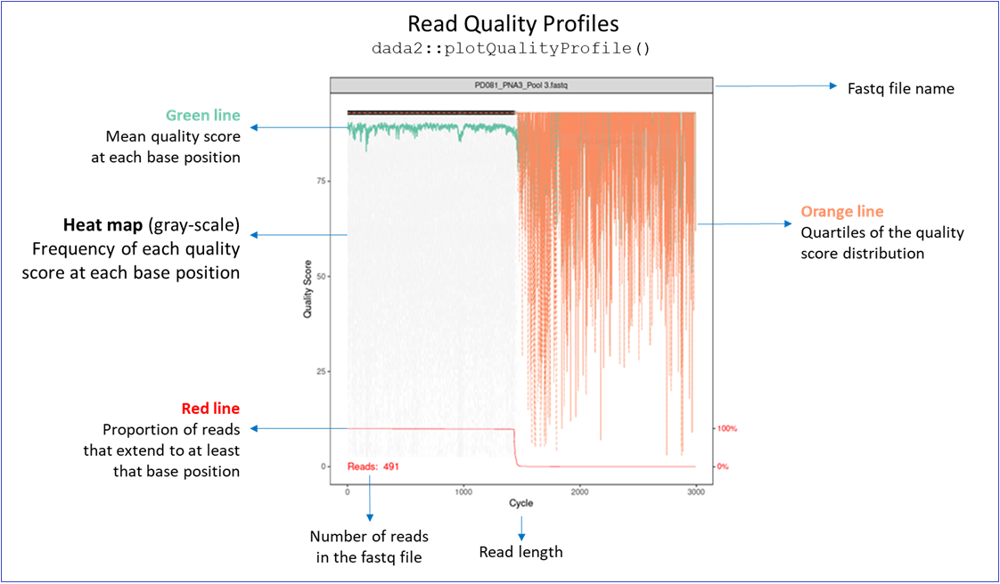
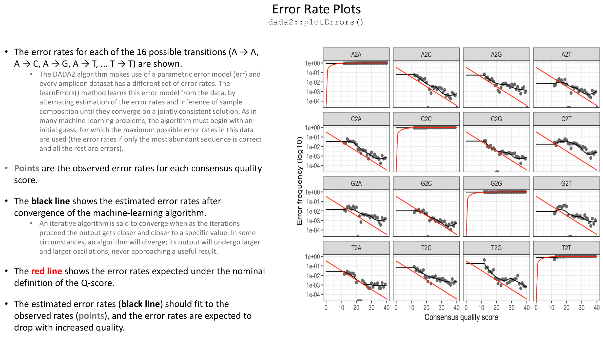

```{r setup, include=FALSE}
# Execute the pipeline once for HTML. The GitHub document is a code/reference
# view; disabling evaluation there avoids repeating expensive analysis and
# trying to screenshot HTML widgets in a non-HTML format.
render_target <- knitr::opts_knit$get("rmarkdown.pandoc.to")
knitr::opts_chunk$set(
  eval = !(grepl("^gfm", render_target) || grepl("markdown_github", render_target, fixed = TRUE)),
  #eval = FALSE,
  echo = TRUE
)
```

```{css custom-styles, echo=FALSE, eval=knitr::is_html_output()}
/* Custom styling for improved readability */
body {
  font-size: 16px;
  line-height: 1.6;
}

h1, h2, h3 {
  color: #2c3e50;
  margin-top: 1.5em;
}

/* Code and code-output font size is pinned explicitly (rather than left to
   inherit from body) so that raising the prose size above does not also
   enlarge code blocks, inline code, or printed console output -- those stay
   at this project's original 14px regardless of any future prose-size
   changes. */
code {
  background-color: #F2F2F2;
  color: #2c3e50;
  padding: 2px 6px;
  border-radius: 3px;
  font-size: 14px;
}

pre, pre code {
  font-size: 14px;
}

.alert-info {
  background-color: #2c3e50;
  color: #ffffff;
  border-left: 4px solid #f39c12;
  padding: 12px;
  margin: 15px 0;
}

.alert-warning {
  background-color: #2c3e50;
  color: #ffffff;
  border-left: 4px solid #e74c3c;
  padding: 12px;
  margin: 15px 0;
}

.alert-success {
  background-color: #d4edda;
  color: #155724;
  border-left: 4px solid #28a745;
  padding: 12px;
  margin: 15px 0;
}

/* Table cells wrap long content (long inline code, sentences) instead of
   overflowing or forcing horizontal scroll. */
table {
  width: 100%;
}

th, td {
  white-space: normal;
  word-wrap: break-word;
  overflow-wrap: break-word;
}

/* Style for parameter display */
.param-box {
  font-family: monospace;
  background-color: #f0f0f0;
  padding: 2px 6px;
  border-radius: 3px;
  font-size: 14px;
}

/* Forces DT/DataTables columns (tagged via columnDefs' className below,
   see "display-taxonomy-tables") to wrap long cell text instead of sizing
   each column to its widest unwrapped line -- !important is needed
   because DataTables' own scrollX column-sizing logic can otherwise take
   precedence over the plain `th, td` rule above. */
table.dataTable td.dt-wrap,
table.dataTable th.dt-wrap {
  white-space: normal !important;
  word-wrap: break-word;
  overflow-wrap: break-word;
}
```

# Introduction

## Purpose

This notebook is **Step 5** of the 16S rRNA sequencing data processing pipeline. It implements the complete [DADA2](https://benjjneb.github.io/dada2/) workflow for high-resolution analysis of microbial communities from high-throughput sequencing data.

## Prerequisites

Before running this notebook, ensure that:

1.  Primer-trimmed FASTQ files are present in the [results/3_cutadapt_primer_trimming/primer_trimmed_reads/](../../results/3_cutadapt_primer_trimming/primer_trimmed_reads/) directory
2.  **[Step 3 (Primer Trimming)](3_cutadapt_primer_trimming.md)** has been completed successfully
3.  Taxonomy training sets are available in the [tools/trainsets/](../../tools/trainsets/) directory
4.  Either save the selected DADA2 parameters from the Shiny App ([Step 4](4_dada2_parameter_selection.md)), or configure the parameters in [Configure DADA2 Parameters](#load-shiny-params)

## What This Notebook Does

The workflow accomplishes the following tasks:

1. **Read filtering**: Sequential removal of read pairs shorter than 100 bp, then read pairs containing ambiguous bases (N), then low-quality reads (truncation, maxEE, PhiX), with read losses tracked at each stage.
2. **Dereplication and learning error rates**: Consolidating identical sequences into unique reads for efficient processing and modeling sequencing errors to differentiate them from real variants.
3. **Sample inference (denoising)**: Distinguishing true biological sequences from sequencing noise, using the error rate models learned in the previous step.
4. **Merging paired reads**: Combining forward and reverse reads to reconstruct
the complete sequence.
5. **Removing chimeras**: Identifying and discarding artificially merged
sequences that can distort findings.
6. **Creating ASV table**: Generating a table of Amplicon Sequence Variants
(ASVs) to represent the composition of the microbial community.
7. **Assigning taxonomy**: classifying each ASV to known taxonomic categories by comparing them against a reference database of curated sequences, enabling the identification of microbial taxa present in the sequencing data.

## Expected Input

-   **Location**: Primer-trimmed FASTQ files from Step 3 in [results/3_cutadapt_primer_trimming/primer_trimmed_reads/](../../results/3_cutadapt_primer_trimming/primer_trimmed_reads/)
-   **Optional parameter report**: [results/4_dada2_parameter_selection/dada2_filter_parameters.xlsx](../../results/4_dada2_parameter_selection/dada2_filter_parameters.xlsx). When present, its Step 4 selections are loaded automatically; when absent, the values in section [Configure DADA2 Parameters](#load-shiny-params) are used.
-   **Naming Convention**: Paired files must follow a consistent naming pattern, for example:
    -   Forward reads: `{sample_id}_L001_R1_001.fastq.gz` or `{sample_id}_L001_R1_001.fastq`
    -   Reverse reads: `{sample_id}_L001_R2_001.fastq.gz` or `{sample_id}_L001_R2_001.fastq`
    -   `.fastq`, `.fq`, and their gzip-compressed variants are detected case-insensitively. Step 3 preserves the input filename and compression state, so this notebook recognizes the same variants.
-   **Format**: Standard FASTQ format (4-line records per read)

## Expected Output

-   Filtered reads in [results/5_dada2_pipeline/filtered_reads/](../../results/5_dada2_pipeline/filtered_reads/)
-   Quality profile plots (PDF) for before filtering ([fwd](../../results/5_dada2_pipeline/QC_fwd_before_filtering.pdf) / [rev](../../results/5_dada2_pipeline/QC_rev_before_filtering.pdf)) and after filtering ([fwd](../../results/5_dada2_pipeline/QC_fwd_after_filtering.pdf) / [rev](../../results/5_dada2_pipeline/QC_rev_after_filtering.pdf))
-   Error rate plots (PDF) for [forward reads](../../results/5_dada2_pipeline/fwd_error_rates.pdf) and [reverse reads](../../results/5_dada2_pipeline/rev_error_rates.pdf)
-   ASV representative sequences ([asv_sequences.csv](../../results/5_dada2_pipeline/asv_sequences.csv))
-   ASV count table ([asv_count_table.csv](../../results/5_dada2_pipeline/asv_count_table.csv))
-   Taxonomy table(s) - one or two depending on database selection:
    -   [silva_taxonomy_table.csv](../../results/5_dada2_pipeline/silva_taxonomy_table.csv) (if 'SILVA' or 'BOTH' selected)
    -   [gtdb_taxonomy_table.csv](../../results/5_dada2_pipeline/gtdb_taxonomy_table.csv) (if 'GTDB' or 'BOTH' selected)
-   Processing statistics Excel file ([processing_summary.xlsx](../../results/5_dada2_pipeline/processing_summary.xlsx))

------------------------------------------------------------------------

# Environment Setup

## Load Required Packages {#load-packages}

The chunk below loads every R package this notebook depends on, plus three helper functions shared across the whole pipeline: Excel writing, column-dictionary documentation, and clickable output links (each sourced from [R/functions/](../functions/)); it also defines a `safe_datatable()` wrapper used throughout this notebook for consistent, scrollable table display that falls back to a plain printed table if the interactive widget fails to render.

```{r load-packages, message=FALSE, warning=FALSE}
# dada2: Core package for amplicon sequence variant inference
# Provides the complete workflow for 16S/ITS amplicon analysis
library(dada2)

# Biostrings: Biological string manipulation (Bioconductor)
# Used for handling DNA sequences and generating complements
library(Biostrings)

# data.table: High-performance data manipulation
# Provides fast operations for handling large data tables
library(data.table)

# DT: Interactive tables in R Markdown
# Creates searchable, sortable HTML tables
library(DT)

# fs: Cross-platform filesystem operations
# Consistent functions for file and directory manipulation
library(fs)

# ggplot2: Grammar of graphics plotting
# Used for creating publication-quality visualizations
library(ggplot2)

# here: Project-relative file paths
# Enables reproducible path construction regardless of working directory
library(here)

# openxlsx: Excel file creation and manipulation
# Read and write Excel files without Java dependencies
library(openxlsx)

# parallel: Parallel processing support
# Built-in R package for multi-core processing
library(parallel)

# pbapply: Progress bar for apply functions
# Provides visual feedback during long-running operations
library(pbapply)

# png: Read and write PNG images
# Used for combining quality profile plots into PDFs
library(png)

# grid: Grid graphics system
# Used for rendering PNG images in PDF output
library(grid)

# stringr: Consistent string manipulation
# Intuitive string processing functions
library(stringr)

# tidyverse: Collection of data science packages
# Provides consistent data manipulation and visualization tools
library(tidyverse)

# Source our custom Excel utility function from the project's function library
# This function handles creating or appending sheets to Excel workbooks
source(here("R", "functions", "add_sheet_to_excel_function.R"))

# Source our custom column-dictionary builder from the project's function library
# This function documents every column of every sheet written to an Excel workbook
source(here("R", "functions", "build_column_dictionary_function.R"))

# Source our custom output-links helper from the project's function library
# This function renders clickable Markdown links to output files/folders
source(here("R", "functions", "render_output_links_function.R"))

# Source the custom render_output_tree utility function from the project's
# function library. This function prints this notebook's entire output
# folder as a clickable directory tree (used in "Output File Summary" below),
# scanned live from disk at knit time so it always matches what was actually
# produced on this run.
source(here("R", "functions", "render_output_tree_function.R"))

# Safe DataTable Display
#
# Wrapper function to display data tables that handles errors gracefully.
# Falls back to standard print if DT::datatable fails (common in RStudio notebooks).
#
# Every call site in this notebook is merged with `default_datatable_options`
# below (fixed-height scroll box, no Prev/Next paging) unless it explicitly
# overrides one of those keys itself, so every table in this notebook has
# the same fixed-height, continuously-scrollable presentation as the
# kable() + scroll_box() tables in Step 2, without having to repeat these
# three options at every individual call site.
#
# Arguments:
#   data    - A data frame to display
#   options - Optional list of DT options, merged on top of
#             `default_datatable_options` (caller-supplied keys win on conflict).
#   ...     - Additional arguments passed to DT::datatable
# Returns:
#   A datatable object or printed data frame
#
default_datatable_options <- list(
    scrollY = "400px",     # Fixed-height scrollable body
    scrollCollapse = TRUE, # Shrink the box when there are too few rows to fill it
    paging = FALSE         # Continuous scroll instead of Prev/Next pages
)

safe_datatable <- function(data, options = list(), ...) {
    merged_options <- modifyList(default_datatable_options, options)
    tryCatch({
        DT::datatable(data, options = merged_options, ...)
    }, error = function(e) {
        message("Note: Interactive table display failed. Showing static table instead.")
        print(data)
    })
}
```

------------------------------------------------------------------------

# Configuration

## Define Path Parameters {#define-paths}

Set up the input and output directory paths. Using `here()` ensures paths are relative to the project root, making the script portable across different systems.

```{r define-paths}
# Input folder containing primer-trimmed FASTQ files from Step 3
# This should be the output directory from the Cutadapt primer trimming step
input_folder <- here("results", "3_cutadapt_primer_trimming", "primer_trimmed_reads")

# Base results folder for all pipeline outputs
results_folder <- here("results")

# Specific output folder for this step (Step 5: DADA2 Pipeline)
# Numbered prefix maintains pipeline organization
output_folder <- here(results_folder, "5_dada2_pipeline")

# Create the output directory if it does not already exist
if (dir_exists(output_folder)) {
    message("The existing output directory located at ", output_folder,
            "\nwill be used for this step.")
} else {
    cat("Creating new output directory in", output_folder, "\n")
    dir_create(output_folder, recurse = TRUE)
}

# Subdirectory for filtered reads
filtered_reads_folder <- here(output_folder, "filtered_reads")

# Subdirectory for checkpoints (workspace saves)
checkpoints_folder <- here(output_folder, "checkpoints")
dir_create(checkpoints_folder, recurse = TRUE)

# Remove checkpoint files from the former whole-workspace design. They cannot
# be safely validated or resumed by the stage-specific checkpoint system.
legacy_checkpoint_paths <- here(
    checkpoints_folder,
    c("checkpoint_1_filtering.RData", "checkpoint_2_error_rates.RData",
      "checkpoint_3_merged.RData", "checkpoint_4_chimeras.RData",
      "checkpoint_final.RData")
)
legacy_checkpoint_paths <- legacy_checkpoint_paths[file_exists(legacy_checkpoint_paths)]
if (length(legacy_checkpoint_paths)) file_delete(legacy_checkpoint_paths)

# Subdirectory for console output logs
console_output_folder <- here(output_folder, "console_output")
dir_create(console_output_folder, recurse = TRUE)

# Accumulates the paths of every per-stage console log written below (see the
# "Denoise Forward/Reverse Reads", "Merging Paired Reads", "Removing
# Chimeras", and "Assigning Taxonomy" sections). Each of those stages writes
# its own short-lived log file rather than sharing one long-lived sink -- see
# the comment at the top of the "denoise-forward" chunk for why. Appended to
# as the notebook runs; read back in the "Output File Summary" section.
dada2_console_logs <- c()

# Output Excel filename for processing statistics
output_excel_filename <- "processing_summary.xlsx"

# Construct the full path to the output Excel file
output_excel_path <- here(output_folder, output_excel_filename)
```

## Configure DADA2 Parameters {#load-shiny-params}

Step 5 looks first for the parameter report saved by the **Export** tab of the [DADA2 Parameter Explorer](4_dada2_parameter_selection.md) in Step 4. When that report exists, its selected `truncLen`, `maxEE`, and primer-trimmed amplicon-length limits are loaded automatically. When it does not exist, Step 5 uses the fallback values declared at the beginning of the chunk below.

::: {.alert .alert-warning}
**If you did not run Step 4:** review and, when necessary, edit the DADA2 filtering parameters below in [Configure DADA2 Parameters](#load-shiny-params) before running the rest of this notebook. The defaults provide a usable starting point for the example paired-end dataset, but filtering parameters must still be appropriate for the read lengths, quality profiles, primers, and target region in your own data.
:::

To select parameters interactively, run `shiny::runApp(here("R", "shiny", "dada2_parameter_selection_app.R"))`, review the Visualize, Select, and Validate tabs, then use **Save parameters** in Export. The resulting report is exported to [results/4_dada2_parameter_selection/dada2_filter_parameters.xlsx](../../results/4_dada2_parameter_selection/dada2_filter_parameters.xlsx).

### Understanding Read Overlap {#read-overlap}

Key Considerations for Setting truncLen:

- **Quality Score Profiles**: Begin by examining the quality score profiles of your sequencing reads. Reads typically show a decline in quality towards the end, and truncLen should be set at a point before this quality drop becomes pronounced. This ensures the retention of high-quality sequence data.
- **Overlap for Merging**: In paired-end sequencing, it's critical to maintain an adequate overlap between forward and reverse reads post-trimming (>20nt are recommended for dada2). The chosen truncLen values must accommodate sufficient overlap for effective merging, considering any inherent biological length variations in the target regions.
- **Dataset-Specific Settings**: truncLen values should be tailored to the specifics of your dataset. Factors such as the sequencing platform used (e.g., Illumina MiSeq, HiSeq) and the specific regions being targeted (e.g., V3-V4, V4-V5 of the 16S rRNA gene) influence the optimal truncLen settings.
- **Balancing Quality and Length**: Strive to achieve a balance between retaining high-quality sequences and ensuring adequate length for overlap. Excessive trimming can lead to valuable data loss or failed read merging, while insufficient trimming may include low-quality data, adversely affecting downstream processes like OTU clustering or species identification.

```{r configure-dada2-parameters}
# ---------------------------------------------------------------------------
# FILTERING PARAMETERS -- CONFIGURE THESE IF STEP 4 WAS NOT RUN!
# ---------------------------------------------------------------------------
# Step 5 uses these values only when the Step 4 report is absent, a parameter
# is missing from that report, or a saved value is not numeric. The 260/220 bp
# truncation lengths are physically compatible with the example 2 x 300 bp
# primer-trimmed reads while retaining at least 12 bp of overlap at the
# fallback maximum amplicon length of 455 bp.
default_dada2_parameters <- c(
    truncation_length_forward = 260,
    truncation_length_reverse = 220,
    max_expected_errors_forward = 2,
    max_expected_errors_reverse = 2,
    amplicon_min_length = 380,
    amplicon_max_length = 455
)

# This is the exact path written by the Step 4 app's "Save parameters" button.
step4_parameters_path <- here(
    results_folder,
    "4_dada2_parameter_selection",
    "dada2_filter_parameters.xlsx"
)

# Begin with the fallback values, then replace each value available in a valid
# Step 4 report. Keeping the resolved settings in one named vector makes their
# source explicit and prevents definitions from being scattered later in the
# notebook.
resolved_dada2_parameters <- default_dada2_parameters
parameter_sources <- setNames(
    rep("Step 5 fallback", length(default_dada2_parameters)),
    names(default_dada2_parameters)
)
step4_report_loaded <- FALSE
step4_info <- setNames(character(), character())

if (file_exists(step4_parameters_path)) {
    workbook_sheets <- getSheetNames(step4_parameters_path)
    if (!("Parameters" %in% workbook_sheets)) {
        stop("The Step 4 report does not contain a Parameters sheet: ",
             step4_parameters_path)
    }

    # Current reports keep provenance in Info and selected settings in
    # Parameters. The Category fallback preserves compatibility with reports
    # produced by the older app layout.
    step4_parameter_table <- read.xlsx(step4_parameters_path, sheet = "Parameters")
    if (!all(c("Parameter", "Value") %in% names(step4_parameter_table))) {
        stop("The Step 4 Parameters sheet must contain Parameter and Value columns: ",
             step4_parameters_path)
    }
    parameter_rows <- if ("Category" %in% names(step4_parameter_table)) {
        step4_parameter_table[
            is.na(step4_parameter_table$Category) |
                step4_parameter_table$Category == "config",
            ,
            drop = FALSE
        ]
    } else {
        step4_parameter_table
    }
    parameter_rows$Parameter <- trimws(as.character(parameter_rows$Parameter))
    parameter_rows <- parameter_rows[
        !is.na(parameter_rows$Parameter) & nzchar(parameter_rows$Parameter),
        ,
        drop = FALSE
    ]
    if (anyDuplicated(parameter_rows$Parameter)) {
        duplicate_names <- unique(parameter_rows$Parameter[duplicated(parameter_rows$Parameter)])
        stop("The Step 4 report contains duplicate parameters: ",
             paste(duplicate_names, collapse = ", "))
    }

    missing_parameter_names <- setdiff(
        names(default_dada2_parameters),
        parameter_rows$Parameter
    )
    if (length(missing_parameter_names) > 0L) {
        warning("The Step 4 report is missing: ",
                paste(missing_parameter_names, collapse = ", "),
                ". Step 5 fallback values will be used for those settings.")
    }

    for (parameter_name in names(default_dada2_parameters)) {
        saved_row <- which(parameter_rows$Parameter == parameter_name)
        if (length(saved_row) == 1L) {
            saved_value <- suppressWarnings(as.numeric(parameter_rows$Value[[saved_row]]))
            if (length(saved_value) == 1L && is.finite(saved_value)) {
                resolved_dada2_parameters[[parameter_name]] <- saved_value
                parameter_sources[[parameter_name]] <- "Step 4 report"
            } else {
                warning("Step 4 parameter '", parameter_name,
                        "' is not a finite number; using the Step 5 fallback value ",
                        default_dada2_parameters[[parameter_name]], ".")
            }
        }
    }

    info_rows <- if ("Info" %in% workbook_sheets) {
        read.xlsx(step4_parameters_path, sheet = "Info")
    } else if ("Category" %in% names(step4_parameter_table)) {
        step4_parameter_table[
            !is.na(step4_parameter_table$Category) &
                step4_parameter_table$Category == "info",
            ,
            drop = FALSE
        ]
    } else {
        data.frame(Parameter = character(), Value = character())
    }
    if (all(c("Parameter", "Value") %in% names(info_rows))) {
        step4_info <- setNames(as.character(info_rows$Value), info_rows$Parameter)
    }
    get_step4_info <- function(name) {
        if (name %in% names(step4_info)) step4_info[[name]] else "(not recorded)"
    }

    # Refuse to apply settings selected for a different input directory or
    # filename convention. Step 4 records project-relative paths when possible
    # and absolute paths for external data.
    recorded_input_directory <- get_step4_info("input_directory")
    if (identical(recorded_input_directory, "(not recorded)") ||
        !nzchar(trimws(recorded_input_directory))) {
        stop("The Step 4 report does not record its input_directory; recreate it with Step 4 before continuing.")
    }
    recorded_input_path <- if (is_absolute_path(recorded_input_directory)) {
        path_norm(recorded_input_directory)
    } else {
        path_norm(path_abs(recorded_input_directory, start = here()))
    }
    active_input_path <- path_norm(path_abs(input_folder))
    if (!identical(as.character(recorded_input_path), as.character(active_input_path))) {
        stop("The Step 4 report was created for a different FASTQ directory.\n",
             "Recorded: ", recorded_input_path, "\n",
             "Step 5 input: ", active_input_path,
             "\nReload the Step 5 input in Step 4 and save a new parameter report.")
    }

    expected_step4_pattern <- "_L001_R1_001 / _L001_R2_001"
    recorded_pattern <- get_step4_info("file_naming_pattern")
    if (!identical(recorded_pattern, expected_step4_pattern)) {
        stop("The Step 4 report used filename pattern '", recorded_pattern,
             "', but Step 5 is configured for '", expected_step4_pattern,
             "'. Save a matching Step 4 report before continuing.")
    }
    step4_report_loaded <- TRUE

    cat("Loaded DADA2 parameters from the Step 4 report:\n",
        " -", step4_parameters_path, "\n",
        " Generated:", get_step4_info("generated_date"), "\n",
        " Sequencing platform:", get_step4_info("sequencing_platform"), "\n",
        " Primer pair:", get_step4_info("primer_pair"),
        "(", get_step4_info("target_region"), ")\n")
} else {
    cat("No Step 4 parameter report was found at:\n",
        " -", step4_parameters_path, "\n",
        "Step 5 will use default_dada2_parameters. Review and adjust those",
        " values in this configuration section if they are not suitable for",
        " your data.\n")
}

# Validate and assign every active parameter here, before data processing.
integer_parameter_names <- c(
    "truncation_length_forward", "truncation_length_reverse",
    "amplicon_min_length", "amplicon_max_length"
)
if (any(resolved_dada2_parameters[integer_parameter_names] <= 0) ||
    any(resolved_dada2_parameters[integer_parameter_names] !=
        round(resolved_dada2_parameters[integer_parameter_names]))) {
    stop("truncation lengths and amplicon bounds must be positive whole numbers.")
}
if (any(resolved_dada2_parameters[c(
        "max_expected_errors_forward", "max_expected_errors_reverse"
    )] <= 0)) {
    stop("maxEE values must be greater than zero.")
}
if (resolved_dada2_parameters[["amplicon_min_length"]] >
    resolved_dada2_parameters[["amplicon_max_length"]]) {
    stop("amplicon_min_length cannot exceed amplicon_max_length.")
}

truncation_length_forward <- as.integer(resolved_dada2_parameters[["truncation_length_forward"]])
truncation_length_reverse <- as.integer(resolved_dada2_parameters[["truncation_length_reverse"]])
max_expected_errors_forward <- resolved_dada2_parameters[["max_expected_errors_forward"]]
max_expected_errors_reverse <- resolved_dada2_parameters[["max_expected_errors_reverse"]]
amplicon_min_length <- as.integer(resolved_dada2_parameters[["amplicon_min_length"]])
amplicon_max_length <- as.integer(resolved_dada2_parameters[["amplicon_max_length"]])

# Stable processing settings not selected by the Step 4 app.
truncation_quality <- 2
trim_left <- 0
match_ids <- TRUE

active_parameter_table <- data.frame(
    Parameter = names(resolved_dada2_parameters),
    Value = unname(resolved_dada2_parameters),
    Source = unname(parameter_sources),
    row.names = NULL
)
cat("\nActive DADA2 parameters:\n")
```

```{r echo=FALSE}
print(active_parameter_table, row.names = FALSE)
```

```{r echo=FALSE}
cat("\nFixed processing settings:\n",
    "- truncQ:", truncation_quality, "\n",
    "- trimLeft:", trim_left, "\n",
    "- matchIDs:", match_ids, "\n")
```

## Define File Pattern Parameters {#define-patterns}

Configure the file naming patterns used to identify forward and reverse reads.

```{r define-patterns}
# Token identifying forward (Read 1) files in paired-end sequencing,
# written as a regular expression (not a literal string) so it matches
# .fastq/.fq, optional gzip compression, and case-insensitive extensions for
# the pipeline's required L001 token.
forward_pattern <- "(?i)_L001_R1_001\\.(fastq|fq)(\\.gz)?$"

# Token identifying reverse (Read 2) files in paired-end sequencing -- see
# forward_pattern above for why this is a regex rather than a literal
# extension.
reverse_pattern <- "(?i)_L001_R2_001\\.(fastq|fq)(\\.gz)?$"

# Display configuration
cat("File Pattern Configuration:\n",
    "- Forward reads pattern:", forward_pattern, "\n",
    "- Reverse reads pattern:", reverse_pattern, "\n")
```

## Define Processing Parameters {#define-processing-params}

Configure parameters for parallel processing and reproducibility.

```{r define-processing-params}
# Determine the number of CPU threads for parallel processing
# Reserve 2 cores for system operations to maintain responsiveness
# Use at least 1 thread even on single-core systems
detected_cores <- suppressWarnings(detectCores())
available_cores <- if (length(detected_cores) == 1L && is.finite(detected_cores) && detected_cores >= 1) as.integer(detected_cores) else 1L
nr_threads <- max(1L, available_cores - 2L)

# Set non-random seed for reproducibility
# This ensures consistent results across runs
set.seed(42)

# Display configuration
cat("Processing Configuration:\n",
    "- Available CPU cores:", available_cores, "\n",
    "- Threads for DADA2:", nr_threads, "\n",
    "- Random seed:", 42, "\n")
```

## Define Taxonomy Database Selection {#define-taxonomy}

Choose between SILVA, GTDB, or both reference databases for taxonomic assignment.

::: {.alert .alert-warning}
**Important**: Select the appropriate taxonomy database for your analysis. [SILVA](https://www.arb-silva.de/) is widely used for general 16S analysis, while [GTDB](https://gtdb.ecogenomic.org/) provides a genome-based taxonomy that may be more suitable for certain applications. Selecting "BOTH" will generate two separate taxonomy tables for comparison.
:::

```{r define-taxonomy-database}
# Select taxonomy database: "SILVA", "GTDB", or "BOTH"
# SILVA: Widely used, comprehensive ribosomal RNA database
# GTDB: Genome Taxonomy Database, based on genome phylogeny
# BOTH: Run both databases and generate two taxonomy tables for comparison
taxonomy_database <- "BOTH"  # Change to "SILVA", "GTDB", or "BOTH"

# Path to the trainsets folder containing taxonomy reference files
trainsets_folder <- here("tools", "trainsets")
silva_trainset_folder <- here(trainsets_folder, "SILVA")
gtdb_trainset_folder <- here(trainsets_folder, "GTDB")

# Define database configuration list for SILVA and GTDB
database_config <- list(
  
  # -------------------------------
  # SILVA database configuration
  # -------------------------------
  SILVA = list(
    
    # Detect the trainset file (genus-level reference)
    trainset = list.files(
      here(silva_trainset_folder),      # Path to SILVA directory (constructed reproducibly)
      pattern = "genus.*\\.fa(\\.gz)?$", # Regex: match files containing "genus" + .fa or .fa.gz
      ignore.case = TRUE,               # Case-insensitive matching (e.g., Genus, GENUS)
      full.names = TRUE                 # Return full file paths instead of just filenames
    )[1],                                 # Take first match (assumes exactly one correct file)
    
    # Detect the species assignment file
    species = list.files(
      here(silva_trainset_folder),      # Same SILVA directory
      pattern = "species.*\\.fa(\\.gz)?$", # Regex: match files containing "species"
      ignore.case = TRUE,               # Case-insensitive matching
      full.names = TRUE                 # Return full paths
    )[1]                                  # Take first match
  ),
  
  # -------------------------------
  # GTDB database configuration
  # -------------------------------
  GTDB = list(
    
    # Detect the trainset file (genus-level reference)
    trainset = list.files(
      here(gtdb_trainset_folder),       # Path to GTDB directory
      pattern = "genus.*\\.fa(\\.gz)?$", # Match "genus" FASTA files
      ignore.case = TRUE,               # Case-insensitive
      full.names = TRUE                 # Return full paths
    )[1],                                 # Take first match
    
    # Detect the species assignment file
    species = list.files(
      here(gtdb_trainset_folder),       # Same GTDB directory
      pattern = "species.*\\.fa(\\.gz)?$", # Match "species" FASTA files
      ignore.case = TRUE,               # Case-insensitive
      full.names = TRUE                 # Return full paths
    )[1]                                  # Take first match
  )
)

# Determine which databases to use
if (taxonomy_database == "BOTH") {
    databases_to_use <- c("SILVA", "GTDB")
} else if (taxonomy_database %in% c("SILVA", "GTDB")) {
    databases_to_use <- taxonomy_database
} else {
    stop("Invalid taxonomy database selection. Choose 'SILVA', 'GTDB', or 'BOTH'.")
}

# Display configuration and verify files exist
cat("Taxonomy Database Configuration:\n")
```

```{r echo=FALSE}
cat("- Selected option:", taxonomy_database, "\n")
```

```{r echo=FALSE}
cat("- Databases to process:", paste(databases_to_use, collapse = ", "), "\n\n")
```

```{r echo=FALSE}
for (db in databases_to_use) {
    cat(db, "database:\n")
    cat("  - Trainset:", basename(database_config[[db]]$trainset), "\n")
    cat("  - Species:", basename(database_config[[db]]$species), "\n")
    
    # Verify files exist
    if (!file_exists(database_config[[db]]$trainset)) {
        warning(db, " trainset file not found: ", database_config[[db]]$trainset)
    }
    if (!file_exists(database_config[[db]]$species)) {
        warning(db, " species assignment file not found: ", database_config[[db]]$species)
    }
}
```

------------------------------------------------------------------------

# Discover Input Files

## Read FASTQ Files {#read-fastq-files}

Scan the input directory for paired-end FASTQ files and verify pairing.

```{r read-fastq-files}
# Fail early if the prerequisite folder is absent.
if (!dir_exists(input_folder)) {
    stop("Primer-trimmed input folder not found: ", input_folder,
         "\nRun Step 3 before this notebook.")
}

# Get the forward and reverse file paths using the filename patterns and sort the lists
forward_read_paths <- sort(list.files(
    path = input_folder,
    pattern = forward_pattern,
    full.names = TRUE
))

reverse_read_paths <- sort(list.files(
    path = input_folder,
    pattern = reverse_pattern,
    full.names = TRUE
))

# Extract sample names from forward and reverse files
forward_sample_names <- unname(sapply(basename(forward_read_paths), function(x) {
    gsub(pattern = forward_pattern, replacement = "", x = x)
}))

reverse_sample_names <- unname(sapply(basename(reverse_read_paths), function(x) {
    gsub(pattern = reverse_pattern, replacement = "", x = x)
}))

# Require a non-empty, exactly paired set before any downstream object is made.
if (length(forward_read_paths) == 0L || length(reverse_read_paths) == 0L) {
    stop("No paired FASTQ files matched the configured patterns in: ", input_folder,
         "\nForward pattern: ", forward_pattern,
         "\nReverse pattern: ", reverse_pattern)
}
if (length(forward_sample_names) != length(reverse_sample_names) ||
    !identical(forward_sample_names, reverse_sample_names)) {
    stop("Forward and reverse FASTQ files are not exactly paired. Found ",
         length(forward_sample_names), " forward and ",
         length(reverse_sample_names), " reverse files.\n",
         "Forward-only stems: ", paste(setdiff(forward_sample_names, reverse_sample_names), collapse = ", "), "\n",
         "Reverse-only stems: ", paste(setdiff(reverse_sample_names, forward_sample_names), collapse = ", "))
}

# The project naming convention defines SampleID as the part before the first
# underscore, consistently with Steps 1-3.
sample_names <- sub("_.*$", "", forward_sample_names)
if (anyDuplicated(sample_names)) {
    stop("Sample IDs are not unique before the first underscore: ",
         paste(unique(sample_names[duplicated(sample_names)]), collapse = ", "))
}

# The directory and pattern checks above prevent obvious cross-run reuse; the
# recorded paired-sample count catches a changed dataset at the same location.
if (isTRUE(step4_report_loaded)) {
    recorded_sample_count <- suppressWarnings(as.numeric(get_step4_info("n_samples")))
    if (!is.finite(recorded_sample_count) || recorded_sample_count != length(sample_names)) {
        stop("The Step 4 report records ", get_step4_info("n_samples"),
             " sample(s), but Step 5 discovered ", length(sample_names),
             " in the input directory. Reload the current data in Step 4 and save a new report.")
    }
}

# Create sample overview table.
sample_table <- data.frame(
    SampleID = sample_names,
    Forward_File = basename(forward_read_paths),
    Reverse_File = basename(reverse_read_paths),
    stringsAsFactors = FALSE
)

# Checkpoints are reusable only when the source FASTQs, active parameters,
# processing settings, and DADA2 version are unchanged. MD5 checksums make a
# changed file detectable even if its name, size, and timestamp are preserved.
selected_reference_paths <- unname(unlist(database_config[databases_to_use]))
selected_reference_md5 <- vapply(selected_reference_paths, function(path) {
    if (length(path) == 1L && !is.na(path) && file_exists(path)) {
        unname(tools::md5sum(path))
    } else {
        NA_character_
    }
}, character(1))
pipeline_signature <- list(
    input_paths = path_norm(c(forward_read_paths, reverse_read_paths)),
    input_md5 = unname(tools::md5sum(c(forward_read_paths, reverse_read_paths))),
    parameters = resolved_dada2_parameters,
    processing = list(
        truncation_quality = truncation_quality,
        trim_left = trim_left,
        match_ids = match_ids,
        min_overlap = 12L,
        max_mismatch = 0L
    ),
    taxonomy = list(
        selection = taxonomy_database,
        reference_paths = selected_reference_paths,
        reference_md5 = unname(selected_reference_md5)
    ),
    dada2_version = as.character(packageVersion("dada2"))
)

checkpoint_path <- function(stage) {
    here(checkpoints_folder, paste0("checkpoint_", stage, ".rds"))
}

load_stage_checkpoint <- function(stage, required_objects) {
    path <- checkpoint_path(stage)
    if (!file_exists(path)) return(NULL)
    checkpoint <- tryCatch(readRDS(path), error = function(e) {
        warning("Ignoring unreadable checkpoint ", basename(path), ": ",
                conditionMessage(e), call. = FALSE)
        NULL
    })
    if (is.null(checkpoint) || !identical(checkpoint$signature, pipeline_signature) ||
        !identical(checkpoint$stage, stage) ||
        !all(required_objects %in% names(checkpoint$objects))) {
        message("Ignoring incompatible checkpoint: ", basename(path))
        return(NULL)
    }
    message("Resuming from validated checkpoint: ", basename(path))
    checkpoint$objects
}

save_stage_checkpoint <- function(stage, objects) {
    path <- checkpoint_path(stage)
    temporary_path <- paste0(path, ".tmp")
    saveRDS(list(stage = stage, signature = pipeline_signature, objects = objects),
            temporary_path, compress = TRUE)
    if (file_exists(path)) file_delete(path)
    file_move(temporary_path, path)
    path
}

# Display results
cat("\nFile Discovery Summary:\n",
    "  Samples found:", length(sample_names), "\n",
    "  Input folder:", input_folder, "\n")
```

```{r echo=FALSE}
# Show sample table
safe_datatable(sample_table, 
          options = list(pageLength = 10, scrollX = TRUE),
          caption = "Discovered paired-end FASTQ files")
```

------------------------------------------------------------------------

# Quality Filtering

The active settings and their source are shown in [Configure DADA2 Parameters](#load-shiny-params). When a Step 4 report is present, those saved selections are used; otherwise the clearly marked Step 5 fallback values are used.

## Inspect Read Quality Profiles Before Filtering {#qc-before}

The distribution of [**quality scores**]{style="color:grey"} at each position is shown as a [**grey-scale**]{style="color:grey"} heat map, with [**dark colors**]{style="color:black"} corresponding to [**higher frequency**]{style="color:black"}.
The plotted lines show positional summary statistics: [**green**]{style="color:#67C1A6"} is the mean, 
[**orange**]{style="color:#FB8C61"} is the [**median**]{style="color:#FB8C61"}, and the [**dashed orange lines**]{style="color:#FB8C61"} are the [**25th**]{style="color:#FB8C61"} and [**75th quantiles**]{style="color:#FB8C61"}. If the sequences vary in length, a [**red line**]{style="color:red"} will be plotted showing the [**read % that extend to at least that position**]{style="color:red"}.



The chunk below generates and saves these quality profile plots -- individually per sample, plus an aggregated overview -- for every forward and reverse FASTQ file, before any filtering has been applied.

```{r echo=FALSE}
cat("Generating quality profiles before filtering...\n")
```

```{r qc-before-filtering}
# Safely generate a quality profile plot
#
# Arguments:
#   fastq_path - Path to a FASTQ file
# Returns:
#   A ggplot object or NULL if failed
#
safe_plot_quality <- function(fastq_path) {
    tryCatch({
        p <- plotQualityProfile(fastq_path)
        return(p)
    }, error = function(e) {
        warning("Could not create a quality profile for ", basename(fastq_path),
                ": ", conditionMessage(e), call. = FALSE)
        return(NULL)
    })
}

# Safely generate an aggregated quality profile plot
#
# Arguments:
#   fastq_paths - Vector of paths to FASTQ files
# Returns:
#   A ggplot object or NULL if failed
#
safe_plot_quality_aggregated <- function(fastq_paths) {
    tryCatch({
        p <- plotQualityProfile(fastq_paths, aggregate = TRUE)
        return(p)
    }, error = function(e) {
        warning("Could not create the aggregated quality profile: ",
                conditionMessage(e), call. = FALSE)
        return(NULL)
    })
}
```

```{r echo=FALSE}
# ============================================================================
# FORWARD READS - Before Filtering
# ============================================================================
cat("\nProcessing forward reads...\n")

# Collect successful plots
forward_plots <- list()
skipped_forward <- c()

# Try aggregated plot first
cat("  Attempting aggregated plot...\n")
agg_plot <- safe_plot_quality_aggregated(forward_read_paths)
if (!is.null(agg_plot)) {
    forward_plots[["aggregated"]] <- agg_plot
    cat("  Aggregated plot successful\n")
} else {
    cat("  Aggregated plot failed\n")
}

# Generate individual plots
cat("  Generating individual plots...\n")
for (i in seq_along(forward_read_paths)) {
    p <- safe_plot_quality(forward_read_paths[i])
    if (!is.null(p)) {
        forward_plots[[sample_names[i]]] <- p
    } else {
        skipped_forward <- c(skipped_forward, sample_names[i])
    }
    if (i %% 5 == 0) cat("    ", i, "/", length(forward_read_paths), "\n")
}
cat("    ", length(forward_read_paths), "/", length(forward_read_paths), " done\n")

# Report skipped
if (length(skipped_forward) > 0) {
    cat("  Skipped (", length(skipped_forward), "): ",
        paste(skipped_forward, collapse = ", "), "\n")
}

# Save to PDF
forward_qc_before_path <- here(output_folder, "QC_fwd_before_filtering.pdf")
if (length(forward_plots) > 0) {
    pdf(forward_qc_before_path, width = 10, height = 6)
    for (p in forward_plots) {
        print(p)
    }
    dev.off()
    cat("  Saved:", forward_qc_before_path, "\n")
    cat("    Total plots:", length(forward_plots), "\n")
    render_output_links(forward_qc_before_path, labels = "Quality profile before filtering (forward, PDF)")
} else {
    cat("  No plots could be generated!\n")
}
```

```{r echo=FALSE}
# ============================================================================
# REVERSE READS - Before Filtering
# ============================================================================
cat("\nProcessing reverse reads...\n")

# Collect successful plots
reverse_plots <- list()
skipped_reverse <- c()

# Try aggregated plot first
cat("  Attempting aggregated plot...\n")
agg_plot <- safe_plot_quality_aggregated(reverse_read_paths)
if (!is.null(agg_plot)) {
    reverse_plots[["aggregated"]] <- agg_plot
    cat("  Aggregated plot successful\n")
} else {
    cat("  Aggregated plot failed\n")
}

# Generate individual plots
cat("  Generating individual plots...\n")
for (i in seq_along(reverse_read_paths)) {
    p <- safe_plot_quality(reverse_read_paths[i])
    if (!is.null(p)) {
        reverse_plots[[sample_names[i]]] <- p
    } else {
        skipped_reverse <- c(skipped_reverse, sample_names[i])
    }
    if (i %% 5 == 0) cat("    ", i, "/", length(reverse_read_paths), "\n")
}
cat("    ", length(reverse_read_paths), "/", length(reverse_read_paths), " done\n")

# Report skipped
if (length(skipped_reverse) > 0) {
    cat("  Skipped (", length(skipped_reverse), "): ",
        paste(skipped_reverse, collapse = ", "), "\n")
}

# Save to PDF
reverse_qc_before_path <- here(output_folder, "QC_rev_before_filtering.pdf")
if (length(reverse_plots) > 0) {
    pdf(reverse_qc_before_path, width = 10, height = 6)
    for (p in reverse_plots) {
        print(p)
    }
    dev.off()
    cat("  Saved:", reverse_qc_before_path, "\n")
    cat("    Total plots:", length(reverse_plots), "\n")
    render_output_links(reverse_qc_before_path, labels = "Quality profile before filtering (reverse, PDF)")
} else {
    cat("  No plots could be generated!\n")
}
```

```{r echo=FALSE}
# ============================================================================
# Summary
# ============================================================================
all_skipped <- unique(c(skipped_forward, skipped_reverse))
if (length(all_skipped) > 0) {
    cat("\nSamples with plotting issues:", length(all_skipped), "\n",
        "  (These will still be processed)\n")
}

cat("\nQuality profile generation complete.\n")
cat("Quality profiles generated.\n",
    "  Forward:", forward_qc_before_path, "\n",
    "  Reverse:", reverse_qc_before_path, "\n")
```

## Validate Filtering Parameters {#filter-params}

::: {.alert .alert-warning}
**Important**: The filtering parameters were already resolved in the upper [Configuration](#load-shiny-params) section. This section validates them against the primer-trimmed reads from [Step 3](3_cutadapt_primer_trimming.md) before filtering begins.
:::

```{r validate-filter-params}
# Preflight the selected lengths against the actual primer-trimmed reads.
# DADA2 discards reads shorter than truncLen; if even the longest read in a
# sample is shorter, that sample is guaranteed to retain zero pairs.
max_fastq_read_length <- function(fastq_path) {
    streamer <- ShortRead::FastqStreamer(fastq_path, n = 100000L)
    on.exit(close(streamer), add = TRUE)
    maximum_length <- 0L
    repeat {
        reads <- ShortRead::yield(streamer)
        if (length(reads) == 0L) break
        maximum_length <- max(maximum_length, Biostrings::width(ShortRead::sread(reads)))
    }
    maximum_length
}
forward_max_lengths <- vapply(forward_read_paths, max_fastq_read_length, integer(1))
reverse_max_lengths <- vapply(reverse_read_paths, max_fastq_read_length, integer(1))

incompatible_forward <- sample_names[forward_max_lengths < truncation_length_forward]
incompatible_reverse <- sample_names[reverse_max_lengths < truncation_length_reverse]
parameter_revision_instruction <- if (step4_report_loaded) {
    paste(
        "Return to the DADA2 Parameter Explorer, choose values supported by",
        "the loaded FASTQs, and click Save parameters in Export."
    )
} else {
    paste(
        "Revise default_dada2_parameters in the upper Configuration section,",
        "or run Step 4 and save a parameter report."
    )
}
if (length(incompatible_forward) > 0L || length(incompatible_reverse) > 0L) {
    stop(
        "The selected truncLen values exceed the longest primer-trimmed read in one or more samples.\n",
        "Selected truncLen (forward/reverse): ", truncation_length_forward, "/",
        truncation_length_reverse, " bp.\n",
        if (length(incompatible_forward) > 0L) paste0(
            "Forward incompatible: ", paste(incompatible_forward, collapse = ", "),
            " (maximum observed range ", min(forward_max_lengths), "-", max(forward_max_lengths), " bp).\n"
        ) else "",
        if (length(incompatible_reverse) > 0L) paste0(
            "Reverse incompatible: ", paste(incompatible_reverse, collapse = ", "),
            " (maximum observed range ", min(reverse_max_lengths), "-", max(reverse_max_lengths), " bp).\n"
        ) else "",
        parameter_revision_instruction
    )
}

overlap_at_max_target <- truncation_length_forward + truncation_length_reverse - amplicon_max_length
if (overlap_at_max_target < 12L) {
    stop("The selected truncLen values provide only ", overlap_at_max_target,
         " bp overlap at the maximum target length (", amplicon_max_length,
         " bp); DADA2's default merge requires at least 12 bp. ",
         parameter_revision_instruction)
}

# Display parameters
cat("Filtering Parameters:\n",
    "- truncLen (Fwd/Rev):", truncation_length_forward, "/", truncation_length_reverse, "\n",
    "- maxEE (Fwd/Rev):", max_expected_errors_forward, "/", max_expected_errors_reverse, "\n",
    "- truncQ:", truncation_quality, "\n",
    "- trimLeft:", trim_left, "\n",
    "- matchIDs:", match_ids, "\n")
```

## Execute Filtering and Trimming {#filter-trim}

The chunk below performs the staged filtering described in the Introduction: dropping read pairs shorter than 100 bp, then those containing ambiguous bases (N), and finally applying DADA2's [`filterAndTrim()`](https://benjjneb.github.io/dada2/reference/filterAndTrim.html) quality filter (truncation length, `maxEE`, `truncQ`, and PhiX removal) using the parameters set above. Read losses at every stage are tracked separately so it is clear where reads are being lost.

```{r filter-and-trim}
filtering_checkpoint_objects <- load_stage_checkpoint(
    "1_filtering",
    c("prefilter_counts", "filtering_summary", "filtered_forward_paths",
      "filtered_reverse_paths", "length_filtered_folder", "n_filtered_folder")
)
if (!is.null(filtering_checkpoint_objects) &&
    all(file_exists(c(filtering_checkpoint_objects$filtered_forward_paths,
                      filtering_checkpoint_objects$filtered_reverse_paths)))) {
    list2env(filtering_checkpoint_objects, envir = environment())
} else {
# Create filtered reads directory structure
dir_create(here(filtered_reads_folder, "forward"), recurse = TRUE)
dir_create(here(filtered_reads_folder, "reverse"), recurse = TRUE)

# ---------------------------------------------------------------------------
# Pre-filtering stages (length filter, then N filter), each performed and
# counted separately so read losses at every step are visible in the tracking
# table. These replace the <100 bp length filter and the N filter that used to
# live in Step 3. Their outputs go to transient subfolders that are deleted
# once the quality filter has run.
# ---------------------------------------------------------------------------
length_filtered_folder <- here(output_folder, "length_filtered_reads")
n_filtered_folder      <- here(output_folder, "n_filtered_reads")
dir_create(here(length_filtered_folder, "forward"), recurse = TRUE)
dir_create(here(length_filtered_folder, "reverse"), recurse = TRUE)
dir_create(here(n_filtered_folder, "forward"), recurse = TRUE)
dir_create(here(n_filtered_folder, "reverse"), recurse = TRUE)

gzip_basename <- function(path) {
    filename <- basename(path)
    ifelse(grepl("\\.gz$", filename, ignore.case = TRUE), filename, paste0(filename, ".gz"))
}
length_filtered_forward_paths <- here(length_filtered_folder, "forward", gzip_basename(forward_read_paths))
length_filtered_reverse_paths <- here(length_filtered_folder, "reverse", gzip_basename(reverse_read_paths))
n_filtered_forward_paths      <- here(n_filtered_folder, "forward", gzip_basename(forward_read_paths))
n_filtered_reverse_paths      <- here(n_filtered_folder, "reverse", gzip_basename(reverse_read_paths))

# Stage 1 -- length filter: drop read pairs where either read is shorter than
# 100 bp (the gate that used to be cutadapt's --minimum-length 100). No
# truncation, no N or quality filtering here.
cat("Stage 1: length filter (removing read pairs < 100 bp)...\n")
length_filter_track <- filterAndTrim(
    fwd = forward_read_paths,            filt     = length_filtered_forward_paths,
    rev = reverse_read_paths,            filt.rev = length_filtered_reverse_paths,
    minLen = 100, truncLen = 0, maxN = Inf, maxEE = Inf, truncQ = 0,
    rm.phix = FALSE, matchIDs = match_ids,
    compress = TRUE, multithread = nr_threads, verbose = TRUE
)

# Stage 2 -- N filter: drop read pairs containing any ambiguous base (N), which
# dada() does not allow. No length or quality filtering here.
cat("Stage 2: N filter (removing read pairs containing N)...\n")
n_filter_track <- filterAndTrim(
    fwd = length_filtered_forward_paths, filt     = n_filtered_forward_paths,
    rev = length_filtered_reverse_paths, filt.rev = n_filtered_reverse_paths,
    maxN = 0, minLen = 20, truncLen = 0, maxEE = Inf, truncQ = 0,
    rm.phix = FALSE, matchIDs = match_ids,
    compress = TRUE, multithread = nr_threads, verbose = TRUE
)

# filterAndTrim() derives row names independently from each stage's input
# filenames. Stage 2 therefore uses the transient Stage 1 filenames, which may
# differ from the original basenames after compression suffix normalization.
# Both calls preserve input order, so validate their row counts and assign the
# already validated sample identifiers explicitly before combining counts.
if (nrow(length_filter_track) != length(sample_names) ||
    nrow(n_filter_track) != length(sample_names)) {
    stop(
        "Pre-filter tracking returned an unexpected number of samples: ",
        "expected ", length(sample_names), ", length stage returned ",
        nrow(length_filter_track), ", and N-filter stage returned ",
        nrow(n_filter_track), "."
    )
}
rownames(length_filter_track) <- sample_names
rownames(n_filter_track) <- sample_names

prefilter_counts <- data.frame(
    SampleID            = sample_names,
    Raw_Reads           = as.integer(length_filter_track[sample_names, "reads.in"]),
    After_Length_Filter = as.integer(length_filter_track[sample_names, "reads.out"]),
    After_N_Filter      = as.integer(n_filter_track[sample_names, "reads.out"]),
    stringsAsFactors    = FALSE
)

# Define output paths for filtered reads
filtered_forward_paths <- here(
    filtered_reads_folder, "forward",
    gzip_basename(forward_read_paths)
)

filtered_reverse_paths <- here(
    filtered_reads_folder, "reverse",
    gzip_basename(reverse_read_paths)
)

cat("Starting filtering and trimming...\n",
    "This may take several minutes depending on dataset size.\n\n")

# Execute filterAndTrim with selected parameters
filtering_results <- filterAndTrim(
    # The file path(s) to the forward fastq file(s)
    fwd = n_filtered_forward_paths,
    # The path(s) to the output filtered file(s) corresponding to the fwd input files
    filt = filtered_forward_paths,
    # The file path(s) to the reverse fastq file(s)
    rev = n_filtered_reverse_paths,
    # The path(s) to the output filtered file(s) corresponding to the rev input files
    filt.rev = filtered_reverse_paths,
    # If TRUE, the output fastq file(s) are gzipped
    compress = TRUE,
    # Truncate reads at the first instance of a quality score less than or equal
    # to truncQ. This is in addition to any trimming defined by truncLen. If
    # truncQ causes the read to be trimmed before it reaches the length
    # specified in truncLen, the truncQ trimming takes precedence.
    truncQ = truncation_quality,
    # Truncate reads after truncLen bases. Reads shorter than this are discarded.
    # Truncation lengths are given for the fwd and rev reads, respectively.
    # In general I (1) pick truncLen parameters that avoid the worst parts of
    # the quality profiles but ensure that enough sequence is kept to healthily
    # overlap (truncLen[[1]] + truncLen[[2]] > amplicon_length +
    # biological.length.variation), and err a bit on the more sequence side
    truncLen = c(truncation_length_forward, truncation_length_reverse),
    # The number of nucleotides to remove from the start of each read. If both   truncLen
    # and trimLeft are provided, filtered reads will have length truncLen-trimLeft
    trimLeft = trim_left,
    # N-filtering is done in Stage 2 above, so reads entering this quality filter
    # are already N-free (required by dada()); maxN = Inf skips the redundant check.
    maxN = Inf,
    # > "maxEE" stands for "maximum expected errors." The expected error of a
    #   sequence is calculated based on the quality scores of each base in that
    #   sequence. Essentially, it's a sum of the probabilities of each base
    #   being an error, as inferred from the quality scores (Q) provided
    #   by the sequencing platform: maxEE = sum(P)
    # > "Q" is related to the probability of an error (P) by the formula
    #   P = 10^(-Q/10). So, a higher Q-score indicates a lower probability of
    #   error: Q = -10log10(P)
    # > The maxEE parameter is used in DADA2 to filter sequences. Sequences with
    #   a total expected error rate exceeding the maxEE threshold are discarded.
    #   Very stringent filtering: maxEE < 1 (e.g., 0.5, 0.1)
    #   Moderate filtering: maxEE ≈ 1-2
    #   Less stringent filtering: maxEE > 2 (e.g., 2, 5, 10)
    #   If you use different maxEE values for fwd and reverse, then use
    #   maxEE = c(x,y). If x=y, e.g. maxEE = c(2,2), it can be also simply
    #   given as one value maxEE = 2.
    maxEE = c(max_expected_errors_forward, max_expected_errors_reverse),
    # If TRUE, discard reads that match against the phiX genome, as determined
    # by isPhiX. PhiX is a bacteriophage, specifically PhiX174, which is often
    # used as an internal control in Illumina sequencing runs to monitor the
    # quality of the sequencing process. It's a known reference genome, so its
    # presence can help assess sequencing errors.  PhiX reads are not part of
    # your actual biological samples. Including them in your analysis can
    # introduce noise and potentially affect the accuracy of your results.
    # Removing PhiX reads helps in cleaning the dataset, ensuring that the
    # subsequent analysis steps are performed only on the relevant biological
    # data.
    rm.phix = TRUE,
    # Paired-read filtering only. Whether to enforce matching between the
    # id-line sequence identifiers of the forward and reverse fastq files. If
    # TRUE, only paired reads that share id fields are output. If FALSE, no
    # read ID checking is done. Note: matchIDs=FALSE essentially assumes
    # matching order between forward and reverse reads. If that matched order
    # is not present future processing steps may break (in particular mergePairs)!
    # Set to FALSE for SRA samples or files with non-standard FASTQ headers!!!
    matchIDs = match_ids,
    # Set the number of CPU cores for parallel processing
    multithread = nr_threads,
    # Whether to output status messages
    verbose = TRUE
)

# Create filtering summary table
filtering_summary <- as.data.frame(filtering_results)
filtering_summary$SampleID <- sample_names
filtering_summary$Retention_Percent <- round(
    filtering_summary$reads.out / filtering_summary$reads.in * 100, 2
)

if (sum(filtering_summary$reads.in) == 0L) {
    stop("No reads reached the DADA2 quality-filtering stage.")
}
zero_retention_samples <- filtering_summary$SampleID[filtering_summary$reads.out == 0L]
if (length(zero_retention_samples) > 0L) {
    stop(
        "Quality filtering retained zero read pairs for ", length(zero_retention_samples),
        " sample(s): ", paste(zero_retention_samples, collapse = ", "), ".\n",
        "The current truncLen values are ", truncation_length_forward, "/",
        truncation_length_reverse, " bp. Reads shorter than truncLen are discarded; ",
        "review the primer-trimmed read lengths and quality profiles in the DADA2 Parameter Explorer, ",
        "save compatible parameters in its Export tab, and rerun Step 5."
    )
}

# Reorder columns
filtering_summary <- filtering_summary[, c("SampleID", "reads.in", "reads.out", "Retention_Percent")]
colnames(filtering_summary) <- c("SampleID", "Input_Reads", "Filtered_Reads", "Retention_Percent")

# Display summary
cat("\nFiltering Summary:\n",
    "  Total input reads:", format(sum(filtering_summary$Input_Reads), big.mark = ","), "\n",
    "  Total filtered reads:", format(sum(filtering_summary$Filtered_Reads), big.mark = ","), "\n",
    "  Overall retention:", round(sum(filtering_summary$Filtered_Reads) /
                                   sum(filtering_summary$Input_Reads) * 100, 2), "%\n")
}
```

```{r echo=FALSE}
# Display table
safe_datatable(filtering_summary,
          options = list(pageLength = 10, scrollX = TRUE),
          caption = "Filtering results per sample")

cat("Filtering complete.\n")

render_output_links(filtered_reads_folder, labels = "Filtered FASTQ reads (folder)")

# The length- and N-filtered reads were only needed to feed the quality filter
# and to count stage-wise losses (already captured in prefilter_counts); remove
# them so only the final quality-filtered reads remain on disk.
if (dir_exists(length_filtered_folder)) dir_delete(length_filtered_folder)
if (dir_exists(n_filtered_folder))      dir_delete(n_filtered_folder)
cat("Removed transient length-/N-filtered intermediate folders.\n")
```

## Save Filtering Checkpoint {#export-filtering}

This saves only the objects required by the next stage. On a later run the notebook validates the checkpoint against checksums of every input FASTQ, all active processing parameters, and the DADA2 version; a matching checkpoint is loaded automatically and the filtering work is skipped.

```{r export-filtering-results, echo=FALSE}
# Note: the per-sample filtering summary (filtering_summary) is displayed
# above as an interactive table but is intentionally NOT written to
# processing_summary.xlsx as a separate "Filtering_Results" sheet -- the
# same numbers are already captured, per sample, in the "Reads_Tracking"
# sheet's After_QualityFilter column (see "Track Reads Through Pipeline"
# below), so a dedicated sheet would just duplicate that column.

# Save a narrow, validated checkpoint rather than the complete R workspace.
checkpoint_1 <- save_stage_checkpoint(
    "1_filtering",
    list(
        prefilter_counts = prefilter_counts,
        filtering_summary = filtering_summary,
        filtered_forward_paths = filtered_forward_paths,
        filtered_reverse_paths = filtered_reverse_paths,
        length_filtered_folder = length_filtered_folder,
        n_filtered_folder = n_filtered_folder
    )
)
render_output_links(checkpoint_1, labels = "DADA2 checkpoint 1 (RDS, post-filtering)")
cat("Checkpoint saved:", checkpoint_1, "\n")
```

## Quality Profiles After Filtering {#qc-after}

The same plots are regenerated here using the filtered reads, to confirm the filtering parameters above achieved acceptable quality.

```{r qc-after-filtering, echo=FALSE}
# Get the filtered files that exist
filtered_forward_existing <- filtered_forward_paths[file_exists(filtered_forward_paths)]
filtered_reverse_existing <- filtered_reverse_paths[file_exists(filtered_reverse_paths)]
filtered_sample_names <- sample_names[file_exists(filtered_forward_paths)]

# Name the filtered file-path vectors by their clean sample-name strings
# (not the raw FASTQ file paths). This is the standard DADA2 convention
# (see the official "Big Data" tutorial: names(filtFs) <- sample.names)
# and matters beyond just these two objects: dada() and derepFastq()
# propagate names(fls) into the dada-class/derep-class objects they
# return, so forward_denoised, reverse_denoised, and merged_sequences
# below all inherit whatever naming is set here -- and makeSequenceTable()
# in turn uses names(merged_sequences) as rownames(sequence_table). Left
# unnamed, dada() falls back to naming each element after its full input
# file path, so rownames(sequence_table) end up as raw file paths instead
# of sample names. That silently breaks any later name-based match()
# against valid_samples/sample_names in "Track Reads Through Pipeline"
# (this was the root cause of After_Amplicon_Length_Filter previously
# coming back as all NA -- it was matching clean sample names against
# file-path-based names that could never equal them).
names(filtered_forward_existing) <- filtered_sample_names
names(filtered_reverse_existing) <- filtered_sample_names

cat("Generating quality profiles after filtering...\n")
cat("  Filtered forward files:", length(filtered_forward_existing), "\n")
cat("  Filtered reverse files:", length(filtered_reverse_existing), "\n")

# ============================================================================
# FORWARD READS - After Filtering
# ============================================================================
cat("\nProcessing filtered forward reads...\n")

forward_filtered_plots <- list()

# Try aggregated plot
if (length(filtered_forward_existing) >= 2) {
    cat("  Attempting aggregated plot...\n")
    agg_plot <- safe_plot_quality_aggregated(filtered_forward_existing)
    if (!is.null(agg_plot)) {
        forward_filtered_plots[["aggregated"]] <- agg_plot
        cat("  Aggregated plot successful\n")
    } else {
        cat("  Aggregated plot failed\n")
    }
}

# Individual plots
cat("  Generating individual plots...\n")
for (i in seq_along(filtered_forward_existing)) {
    p <- safe_plot_quality(filtered_forward_existing[i])
    if (!is.null(p)) {
        forward_filtered_plots[[filtered_sample_names[i]]] <- p
    }
    if (i %% 5 == 0) cat("    ", i, "/", length(filtered_forward_existing), "\n")
}
cat("    ", length(filtered_forward_existing), "/", length(filtered_forward_existing), " done\n")

# Save to PDF
forward_qc_after_path <- here(output_folder, "QC_fwd_after_filtering.pdf")
if (length(forward_filtered_plots) > 0) {
    pdf(forward_qc_after_path, width = 10, height = 6)
    for (p in forward_filtered_plots) {
        print(p)
    }
    dev.off()
    cat("  Saved:", forward_qc_after_path, "\n")
    render_output_links(forward_qc_after_path, labels = "Quality profile after filtering (forward, PDF)")
}

# ============================================================================
# REVERSE READS - After Filtering
# ============================================================================
cat("\nProcessing filtered reverse reads...\n")

reverse_filtered_plots <- list()

# Try aggregated plot
if (length(filtered_reverse_existing) >= 2) {
    cat("  Attempting aggregated plot...\n")
    agg_plot <- safe_plot_quality_aggregated(filtered_reverse_existing)
    if (!is.null(agg_plot)) {
        reverse_filtered_plots[["aggregated"]] <- agg_plot
        cat("  Aggregated plot successful\n")
    } else {
        cat("  Aggregated plot failed\n")
    }
}

# Individual plots
cat("  Generating individual plots...\n")
for (i in seq_along(filtered_reverse_existing)) {
    p <- safe_plot_quality(filtered_reverse_existing[i])
    if (!is.null(p)) {
        reverse_filtered_plots[[filtered_sample_names[i]]] <- p
    }
    if (i %% 5 == 0) cat("    ", i, "/", length(filtered_reverse_existing), "\n")
}
cat("    ", length(filtered_reverse_existing), "/", length(filtered_reverse_existing), " done\n")

# Save to PDF
reverse_qc_after_path <- here(output_folder, "QC_rev_after_filtering.pdf")
if (length(reverse_filtered_plots) > 0) {
    pdf(reverse_qc_after_path, width = 10, height = 6)
    for (p in reverse_filtered_plots) {
        print(p)
    }
    dev.off()
    cat("  Saved:", reverse_qc_after_path, "\n")
    render_output_links(reverse_qc_after_path, labels = "Quality profile after filtering (reverse, PDF)")
}

cat("Post-filtering quality profiles generated.\n",
    "  Forward:", forward_qc_after_path, "\n",
    "  Reverse:", reverse_qc_after_path, "\n")
```

------------------------------------------------------------------------

# Learning Error Rates



## Forward Error Rates {#fwd-error-rates}

Sequencing quality often declines toward the end of a read. DADA2 does not model error rates directly by sequencing cycle; `learnErrors()` estimates substitution error rates as a function of the observed quality scores in the filtered reads.

The chunk below builds this error model from the quality-filtered forward reads using DADA2's [`learnErrors()`](https://benjjneb.github.io/dada2/reference/learnErrors.html), which iterates to convergence (up to `MAX_CONSIST` rounds) rather than assuming errors follow the sequencer's reported quality scores exactly.

```{r learn-forward-errors}
error_checkpoint_objects <- load_stage_checkpoint(
    "2_error_rates", c("forward_error_model", "reverse_error_model")
)
error_checkpoint_loaded <- !is.null(error_checkpoint_objects)
dada2_forward_error_model_log <- here(console_output_folder, "dada2_forward_error_model.log")
dada2_reverse_error_model_log <- here(console_output_folder, "dada2_reverse_error_model.log")
if (error_checkpoint_loaded) {
    list2env(error_checkpoint_objects, envir = environment())
} else {
# Own short-lived sink for this chunk -- see the comment at the top of the
# "denoise-forward" chunk for why sinks are scoped to a single chunk here.
dada2_forward_error_model_log <- here(console_output_folder, "dada2_forward_error_model.log")
forward_error_model_log_con <- file(dada2_forward_error_model_log, open = "wt")
sink(forward_error_model_log_con, split = TRUE)

tryCatch({
    cat("Learning error rates for forward reads...\n",
        "This step may take several minutes.\n\n")

    # learnErrors()/dada() report most of their selfConsist progress (per-round
    # "selfConsist step N", per-sample read counts, "Convergence after N
    # rounds.") via cat(), which the sink above already captures, but a few
    # edge-case conditions (e.g. "Self-consistency loop terminated before
    # convergence.") are raised via message() instead -- see the
    # withCallingHandlers() comment in the "merge-paired-reads" chunk for why
    # a plain sink() alone would silently drop those from this log file.
    forward_error_model <- withCallingHandlers({
        learnErrors(
            # The file path(s) to the fastq file(s), or a directory containing fastq
            # file(s). Compressed file formats such as .fastq.gz and .fastq.bz2 are
            # supported
            fls = filtered_forward_existing,
            # If an integer is provided, the number of threads to use is set by passing
            # the argument on to setThreadOptions.
            multithread = nr_threads,
            # The maximum number of times to step through the self-consistency loop. If
            # convergence was not reached in MAX_CONSIST steps, the estimated error
            # rates in the last step are returned.
            MAX_CONSIST = 35,
            # The minimum number of total bases to use for error rate learning. Samples
            # are read into memory until at least this number of total bases has been
            # reached, or all provided samples have been read in.
            nbases = 1e+9,
            # If FALSE, samples are read in the provided order until enough reads are
            # obtained. If TRUE, samples are picked at random from those provided.
            randomize = TRUE,
            # Print verbose text output
            verbose = TRUE
        )
    }, message = function(m) {
        cat(conditionMessage(m))
        invokeRestart("muffleMessage")
    })

    cat("\nForward error model learned.\n")
}, finally = {
    sink()
    close(forward_error_model_log_con)
})
}
```

```{r echo=FALSE}
dada2_console_logs <- c(dada2_console_logs, dada2_forward_error_model_log)
render_output_links(dada2_forward_error_model_log, labels = "Forward error model console log (text)")
```

## Reverse Error Rates {#rev-error-rates}

The equivalent error model for reverse reads, learned the same way from the quality-filtered reverse FASTQ files.

```{r learn-reverse-errors}
if (!error_checkpoint_loaded) {
# Own short-lived sink for this chunk -- see the comment at the top of the
# "denoise-forward" chunk for why sinks are scoped to a single chunk here.
dada2_reverse_error_model_log <- here(console_output_folder, "dada2_reverse_error_model.log")
reverse_error_model_log_con <- file(dada2_reverse_error_model_log, open = "wt")
sink(reverse_error_model_log_con, split = TRUE)

tryCatch({
    cat("Learning error rates for reverse reads...\n",
        "This step may take several minutes.\n\n")

    # See the withCallingHandlers() comment in the "learn-forward-errors"
    # chunk above for why message()-raised edge cases are re-routed through
    # cat() here rather than relying on the sink() alone.
    reverse_error_model <- withCallingHandlers({
        learnErrors(
            fls = filtered_reverse_existing,
            multithread = nr_threads,
            MAX_CONSIST = 35,
            nbases = 1e+9,
            randomize = TRUE,
            verbose = TRUE
        )
    }, message = function(m) {
        cat(conditionMessage(m))
        invokeRestart("muffleMessage")
    })

    cat("\nReverse error model learned.\n")
}, finally = {
    sink()
    close(reverse_error_model_log_con)
})
}
```

```{r echo=FALSE}
dada2_console_logs <- c(dada2_console_logs, dada2_reverse_error_model_log)
render_output_links(dada2_reverse_error_model_log, labels = "Reverse error model console log (text)")
```

## Visualize Error Rates {#visualize-errors}

The error rates for each possible transition (A -> C, A -> G, ...) are shown:

- The [**Grey points**]{style="color:grey"} are the observed error rates for each consensus quality score. 
- The [**solid red line**]{style="color:red"} shows the expected error rates if quality scores exactly matched their nominal definition: Q = -10 log10(p_err)
- The [**dashed black line**]{style="color:black"} shows the input error rates. 
- The [**solid black line**]{style="color:black"} shows the estimated output error rates after convergence of the machine-learning algorithm. 
**Good Model Fit**: In a well-performing error model, we would expect the observed error rates ([**grey points**]{style="color:grey"}) to closely follow the estimated errors ([**solid black line**]{style="color:black"}). This indicates that the error model accurately captures the error properties of the sequencing process. The error rates are expected to drop with increased quality.

```{r plot-error-rates, echo=FALSE}
# Plot forward error rates
forward_error_plot <- plotErrors(
    dq = forward_error_model,
    obs = TRUE,
    err_out = TRUE,
    err_in = TRUE,
    nominalQ = TRUE
) +
    ggtitle("Forward Read Error Rates") +
    theme(plot.title = element_text(hjust = 0.5))

print(forward_error_plot)

ggsave(
    filename = here(output_folder, "fwd_error_rates.pdf"),
    plot = forward_error_plot,
    device = "pdf",
    width = 7,
    height = 7
)

# Plot reverse error rates
reverse_error_plot <- plotErrors(
    dq = reverse_error_model,
    obs = TRUE,
    err_out = TRUE,
    err_in = TRUE,
    nominalQ = TRUE
) +
    ggtitle("Reverse Read Error Rates") +
    theme(plot.title = element_text(hjust = 0.5))

print(reverse_error_plot)

ggsave(
    filename = here(output_folder, "rev_error_rates.pdf"),
    plot = reverse_error_plot,
    device = "pdf",
    width = 7,
    height = 7
)

cat("Error rate plots saved.\n")

# Save only the two learned models; the signature prevents incompatible reuse.
checkpoint_2 <- save_stage_checkpoint(
    "2_error_rates",
    list(forward_error_model = forward_error_model,
         reverse_error_model = reverse_error_model)
)
render_output_links(
    c(here(output_folder, "fwd_error_rates.pdf"), here(output_folder, "rev_error_rates.pdf")),
    labels = c("Forward error rate plot (PDF)", "Reverse error rate plot (PDF)")
)
cat("Checkpoint saved:", checkpoint_2, "\n")
render_output_links(checkpoint_2, labels = "DADA2 checkpoint 2 (RDS, error rates)")
```

------------------------------------------------------------------------

# Sample Inference (Denoising)

Once the error model is established, DADA2 applies the model to the full dataset. It distinguishes between sequencing errors and true biological variants by evaluating the likelihood of observing each unique sequence under the error model. Sequences that are significantly more likely than expected by error are inferred as true ASVs. DADA2's approach results in high-resolution identification of ASVs, often down to single-nucleotide differences. This level of resolution is higher than traditional Operational Taxonomic Unit (OTU) clustering methods, which typically group sequences at a predefined similarity threshold.

## Denoise Forward Reads {#denoise-forward}

```{r denoise-forward}
merged_checkpoint_objects <- load_stage_checkpoint(
    "3_merged", c("forward_denoised", "reverse_denoised", "merged_sequences")
)
merged_checkpoint_loaded <- !is.null(merged_checkpoint_objects)
dada2_denoise_forward_log <- here(console_output_folder, "dada2_denoise_forward.log")
dada2_denoise_reverse_log <- here(console_output_folder, "dada2_denoise_reverse.log")
dada2_merge_pairs_log <- here(console_output_folder, "dada2_merge_pairs.log")
if (merged_checkpoint_loaded) {
    list2env(merged_checkpoint_objects, envir = environment())
} else {
# Console-log sinks in this notebook are scoped to a single chunk each --
# opened, used, and closed (via tryCatch/finally, so the close always runs
# even if the wrapped call errors) entirely within the chunk that produces
# the output. A sink left open across a chunk boundary (the previous design
# here opened one sink in this chunk and did not close it until the
# "format-taxonomy-tables" chunk, ~9 chunks and several hundred lines later)
# can corrupt R's stdout connection stack during a full Knit
# (rmarkdown::render()), which runs every chunk fresh via the `evaluate`
# package -- this produced "Error in stdout() : invalid connection" partway
# through denoising when knitting, even though the same code ran fine when
# executed chunk-by-chunk interactively. Splitting into multiple short-lived,
# per-stage sinks (one log file per stage) avoids that failure mode; if you
# still see "invalid connection" after this change, restart the R session
# before knitting again -- a prior failed knit may have left a stale sink on
# the connection stack, which no amount of in-session sink()/close() calls
# can fully repair.
dada2_denoise_forward_log <- here(console_output_folder, "dada2_denoise_forward.log")
denoise_forward_log_con <- file(dada2_denoise_forward_log, open = "wt")
sink(denoise_forward_log_con, split = TRUE)

tryCatch({
    cat(">> Denoising forward reads\n")
    cat("   Using", nr_threads, "threads for parallel processing\n\n")

    # Inferring amplicon sequence variants (ASVs):
    # Dada2 removes all sequencing errors from amplicon reads to reveal the members of the sequenced community, thereby identifying the correct biological sequences in the reads.
    # Note: By default, the dada function processes each sample independently (i.e. pool = FALSE), if your samples are from an extremely diverse community (e.g. soil), pooling (i.e. pool = TRUE) or pseudo-pooling (recommended; i.e. pool = pseudo) might help in identifying the rare ASVs in each sample
    forward_denoised <- dada(
        filtered_forward_existing,
        err = forward_error_model,
        pool = FALSE,
        multithread = nr_threads,
        verbose = TRUE
    )

    # Inspect the returned dada-class object
    cat("\nForward denoising summary:\n")
    print(forward_denoised)
}, finally = {
    sink()
    close(denoise_forward_log_con)
})
}
```

```{r echo=FALSE}
dada2_console_logs <- c(dada2_console_logs, dada2_denoise_forward_log)
render_output_links(dada2_denoise_forward_log, labels = "Forward denoising console log (text)")
```

## Denoise Reverse Reads {#denoise-reverse}

```{r denoise-reverse}
if (!merged_checkpoint_loaded) {
# Own short-lived sink for this chunk -- see the comment at the top of the
# "denoise-forward" chunk for why sinks are scoped to a single chunk here.
dada2_denoise_reverse_log <- here(console_output_folder, "dada2_denoise_reverse.log")
denoise_reverse_log_con <- file(dada2_denoise_reverse_log, open = "wt")
sink(denoise_reverse_log_con, split = TRUE)

tryCatch({
    cat(">> Denoising reverse reads\n")
    cat("   Using", nr_threads, "threads for parallel processing\n\n")

    reverse_denoised <- dada(
        filtered_reverse_existing,
        err = reverse_error_model,
        pool = FALSE,
        multithread = nr_threads,
        verbose = TRUE
    )

    # Inspect the returned dada-class object
    cat("\nReverse denoising summary:\n")
    print(reverse_denoised)

    cat("\nSample inference complete.\n")
}, finally = {
    sink()
    close(denoise_reverse_log_con)
})
}
```

```{r echo=FALSE}
dada2_console_logs <- c(dada2_console_logs, dada2_denoise_reverse_log)
render_output_links(dada2_denoise_reverse_log, labels = "Reverse denoising console log (text)")
```

------------------------------------------------------------------------

# Merging Paired Reads

**The merging process:**

- **Overlap Detection**: DADA2 aligns each inferred forward sequence with the reverse complement of its paired reverse sequence.
- **Minimum Overlap Requirement**: This notebook requires at least 12 matching bases of overlap (`minOverlap = 12`).
- **Mismatches in Overlap**: This notebook permits no mismatches (`maxMismatch = 0`), so a disagreement causes that inferred pair to be rejected rather than resolved from base-quality scores.
- **Output of Merged Sequences**: Successfully merged read pairs result in extended sequences that cover more of the amplicon region, providing more comprehensive data for downstream analysis like taxonomic classification and diversity assessment.

**Merging results interpretation:**

- **Abundance Information**: The abundance column shows the frequency of each merged pair, which can be crucial for understanding the commonality of certain sequences in your sample.
- **Sequence-pair indices**: The `forward` and `reverse` columns refer to indices of inferred unique sequences in the corresponding DADA objects; they are not original FASTQ read identifiers.
- **High Quality Overlaps**: The absence of mismatches (nmismatch = 0) and indels (nindel = 0) suggests a high-quality overlap between the forward and reverse reads. This is indicative of good sequencing quality and effective merging.
- **Preference field:** The `prefer` field records the direction selected by DADA2's merge logic where applicable; it should not be interpreted as an original-read identifier or a direct comparison of FASTQ quality scores.

```{r merge-paired-reads}
if (!merged_checkpoint_loaded) {
# Own short-lived sink for this chunk -- see the comment at the top of the
# "denoise-forward" chunk for why sinks are scoped to a single chunk here.
dada2_merge_pairs_log <- here(console_output_folder, "dada2_merge_pairs.log")
merge_pairs_log_con <- file(dada2_merge_pairs_log, open = "wt")
sink(merge_pairs_log_con, split = TRUE)

tryCatch({
    cat(">> Merging paired reads\n\n")

    # "mergePairs()" attempts to merge each denoised pair of forward and reverse
    # reads, rejecting any pairs which do not sufficiently overlap or which contain
    # too many (>0 by default) mismatches in the overlap region.
    # Note: This function assumes that the fastq files for the forward and reverse
    # reads were in the same order.
    #
    # With verbose = TRUE, mergePairs() reports its per-sample "N
    # paired-reads (in M unique pairings) successfully merged out of ..."
    # summary via message() (R's stderr stream), not cat()/print() (stdout).
    # The sink() above only redirects stdout, so without the
    # withCallingHandlers() wrapper below, every one of those per-sample
    # lines would print to the console but never reach
    # dada2_merge_pairs.log -- only the cat() calls before/after the call
    # (this chunk's header, the merged-sequences preview, and the closing
    # "complete" line) would be saved. Re-emitting each message through
    # cat() writes it to both the console and the log file (the sink is
    # split = TRUE), then muffleMessage() stops the default handler from
    # also printing it, which would otherwise duplicate every line on-screen.
    merged_sequences <- withCallingHandlers({
        mergePairs(
            dadaF = forward_denoised,
            derepF = filtered_forward_existing,
            dadaR = reverse_denoised,
            derepR = filtered_reverse_existing,
            verbose = TRUE,
            minOverlap = 12,
            maxMismatch = 0
        )
    }, message = function(m) {
        cat(conditionMessage(m))
        invokeRestart("muffleMessage")
    })

    # Display first merged sample
    cat("\nExample of merged sequences (first sample):\n")
    print(head(merged_sequences[[1]]))

    cat("\nPaired read merging complete.\n")
}, finally = {
    sink()
    close(merge_pairs_log_con)
})
}

if (!length(merged_sequences) || sum(vapply(merged_sequences, nrow, integer(1))) == 0L) {
    stop("No paired reads merged successfully. Review truncation lengths, overlap, and read pairing.")
}
```

```{r echo=FALSE}
dada2_console_logs <- c(dada2_console_logs, dada2_merge_pairs_log)
render_output_links(dada2_merge_pairs_log, labels = "Paired-read merging console log (text)")

# Save the denoising and merging results needed by downstream stages.
checkpoint_3 <- save_stage_checkpoint(
    "3_merged",
    list(forward_denoised = forward_denoised,
         reverse_denoised = reverse_denoised,
         merged_sequences = merged_sequences)
)
render_output_links(checkpoint_3, labels = "DADA2 checkpoint 3 (RDS, merged reads)")
cat("Checkpoint saved:", checkpoint_3, "\n")
```

------------------------------------------------------------------------

# Construct Sequence Table

The chunk below assembles the merged sequences from every sample into a single sample-by-sequence abundance matrix (analogous to an OTU table), and visualizes the resulting amplicon length distribution -- annotated with the target amplicon length range -- to help spot off-target lengths before the length filter and chimera removal steps that follow.

```{r construct-sequence-table}
chimera_checkpoint_objects <- load_stage_checkpoint(
    "4_chimeras",
    c("sequence_table_before_length_filter", "sequence_table", "non_chimeric_table",
      "target_length_filtered_reads_per_sample", "sequence_length_df",
      "sequence_length_plot", "chimera_sequences_removed",
      "chimera_sequences_pct", "non_chimeric_reads_pct")
)
chimera_checkpoint_loaded <- !is.null(chimera_checkpoint_objects)
dada2_remove_chimeras_log <- here(console_output_folder, "dada2_remove_chimeras.log")
if (chimera_checkpoint_loaded) {
    list2env(chimera_checkpoint_objects, envir = environment())
} else {
# Construct a sample-by-sequence table (analogous to an OTU table) from the
# provided list of samples
sequence_table <- makeSequenceTable(merged_sequences)
if (ncol(sequence_table) == 0L || sum(sequence_table) == 0L) {
    stop("Merging produced no ASVs with non-zero abundance; sequence-table construction cannot continue.")
}
sequence_table_before_length_filter <- sequence_table

# Get sequence length distribution
sequence_lengths <- table(nchar(getSequences(sequence_table)))

# Convert to data frame for visualization
sequence_length_df <- as.data.frame(sequence_lengths)
colnames(sequence_length_df) <- c("Length", "Count")
sequence_length_df$Length <- as.integer(as.character(sequence_length_df$Length))

# Total number of amplicon sequence variants (ASVs) represented in the
# histogram below, i.e. the number of unique sequences in sequence_table
# before the length filter further down this notebook is applied
total_sequence_variants <- sum(sequence_length_df$Count)

# Number (and percentage) of those ASVs whose length falls inside the target
# amplicon range -- amplicon_min_length/amplicon_max_length, defined once in
# the "Define Amplicon Length Filter Parameters" section of the
# Configuration chapter above -- i.e. the ASVs the length filter below will
# retain
sequence_variants_in_target_range <- sum(
    sequence_length_df$Count[
        sequence_length_df$Length >= amplicon_min_length &
            sequence_length_df$Length <= amplicon_max_length
    ]
)
pct_sequence_variants_in_target_range <- round(
    100 * sequence_variants_in_target_range / total_sequence_variants, 1
)

# Display summary
cat("\nSequence Table Summary:\n",
    "  Total samples:", nrow(sequence_table), "\n",
    "  Total unique sequences:", ncol(sequence_table), "\n",
    "  Length range:", min(sequence_length_df$Length), "-", max(sequence_length_df$Length), "bp\n",
    "  Within target range (", amplicon_min_length, "-", amplicon_max_length, "bp ):",
    sequence_variants_in_target_range, "of", total_sequence_variants,
    paste0("(", pct_sequence_variants_in_target_range, "%)\n"))

# Headroom above the tallest bar so the summary annotation below is not
# clipped by the plot panel
histogram_y_max <- max(sequence_length_df$Count)

# Visualize the amplicon length distribution with a histogram, built from
# the full (pre-filter) sequence table so off-target lengths remain visible.
# Publication-ready styling: white panel with light horizontal gridlines only
# (theme_classic base), bold serif-free axis titles, and the two target-length
# threshold lines identified directly via their own x-axis tick labels (in the
# same firebrick red as the lines) rather than separate floating text
# annotations, so the coordinates read unambiguously as axis values.
sequence_length_plot <- ggplot(sequence_length_df, aes(x = Length, y = Count)) +
    geom_bar(stat = "identity", fill = "#123C69", width = 0.9) +
    # Vertical reference lines marking the minimum and maximum target
    # amplicon lengths
    geom_vline(xintercept = amplicon_min_length, linetype = "dashed", colour = "firebrick3", linewidth = 0.6) +
    geom_vline(xintercept = amplicon_max_length, linetype = "dashed", colour = "firebrick3", linewidth = 0.6) +
    # Summary annotation reporting the total number of ASVs represented in
    # the histogram and how many of them fall inside the target amplicon
    # length range. Anchored to the top-right panel corner (x = Inf, y =
    # Inf) so it stays clear of off-target (typically short/primer-dimer)
    # peaks, which usually sit at the low end of the length axis.
    annotate("label", x = Inf, y = Inf,
             label = paste0(
                 "Total sequences: ", total_sequence_variants, "\n",
                 "Within ", amplicon_min_length, "-", amplicon_max_length, " bp: ",
                 sequence_variants_in_target_range,
                 " (", pct_sequence_variants_in_target_range, "%)"
             ),
             hjust = 1, vjust = 1, size = 3.2, colour = "black",
             fill = "white", label.size = 0.3) +
    # Only the two target-length thresholds are shown as x-axis tick labels
    # (in place of ggplot's default evenly-spaced breaks), so the vertical
    # reference lines are identified solely through their own coordinates on
    # the axis rather than a separate in-panel text label.
    scale_x_continuous(
        breaks = c(amplicon_min_length, amplicon_max_length),
        labels = paste0(c(amplicon_min_length, amplicon_max_length), " bp")
    ) +
    scale_y_continuous(expand = expansion(mult = c(0, 0.05))) +
    labs(x = "Sequence Length (bp)", y = "Frequency",
         title = "Amplicon Length Distribution") +
    # Headroom above the tallest bar for the summary annotation, without
    # dropping any bars from the plot (unlike scale_y_continuous(limits = ...))
    coord_cartesian(ylim = c(0, histogram_y_max * 1.18)) +
    theme_classic(base_size = 12) +
    theme(
        plot.title = element_text(hjust = 0.5, face = "bold", size = 13),
        axis.title = element_text(face = "bold", size = 11),
        axis.text.x = element_text(colour = "firebrick3", face = "bold", size = 10),
        axis.text.y = element_text(colour = "black", size = 10),
        axis.line = element_line(colour = "black", linewidth = 0.4),
        axis.ticks = element_line(colour = "black", linewidth = 0.4),
        panel.grid.major.y = element_line(colour = "grey85", linewidth = 0.3),
        panel.grid.minor = element_blank()
    )
}
```

```{r echo=FALSE}
print(sequence_length_plot)

ggsave(
    filename = here(output_folder, "amplicon_sequence_lengths.pdf"),
    plot = sequence_length_plot,
    device = "pdf",
    width = 7,
    height = 5,
    dpi = 300
)

cat("\n")
render_output_links(here(output_folder, "amplicon_sequence_lengths.pdf"), labels = "Amplicon length distribution (PDF)")

# Note: the sequence length distribution (sequence_length_df) is visualized
# above as a histogram but is intentionally NOT written to
# processing_summary.xlsx as a separate "Sequence_Lengths" sheet -- the PDF
# plot and the summary line printed above are sufficient for this
# diagnostic, and it is not needed downstream.

cat("Sequence table constructed.\n")
```

## Filter by Sequence Length {#filter-length}

Sequences that are much longer or shorter than expected may be the result of non-specific priming. You can remove non-target-length sequences from the sequence table. This is analogous to "cutting a band" in-silico to get amplicons of the targeted length.

```{r filter-sequence-length}
if (!chimera_checkpoint_loaded) {
# Expected amplicon length range -- defined once in the "Define Amplicon
# Length Filter Parameters" section of the Configuration chapter above
# (amplicon_min_length / amplicon_max_length), so it stays in sync with the
# rest of this notebook's configurable parameters.

# Filter sequences by length
sequence_table_filtered <- sequence_table[, nchar(colnames(sequence_table)) %in% amplicon_min_length:amplicon_max_length]
if (ncol(sequence_table_filtered) == 0L || sum(sequence_table_filtered) == 0L) {
    stop("The amplicon-length filter removed every ASV. Review amplicon_min_length and amplicon_max_length.")
}

# Per-sample read totals remaining after removing non-target-length
# sequences -- captured here (rather than re-derived later) so the "Track
# Reads Through Pipeline" table's After_Amplicon_Length_Filter column
# reflects this exact filtering step
target_length_filtered_reads_per_sample <- rowSums(sequence_table_filtered)

# Report filtering
cat("Length filtering:\n",
    "  Before:", ncol(sequence_table), "sequences\n",
    "  After:", ncol(sequence_table_filtered), "sequences\n",
    "  Removed:", ncol(sequence_table) - ncol(sequence_table_filtered), "sequences\n",
    "  Length range:", amplicon_min_length, "-", amplicon_max_length, "bp\n")
}
```

```{r echo=FALSE}
# Use filtered table going forward
if (!chimera_checkpoint_loaded) sequence_table <- sequence_table_filtered
```

------------------------------------------------------------------------

# Removing Chimeras

The core dada method corrects substitution and indel errors, but chimeras remain. Chimeric sequences are identified if they can be exactly reconstructed by combining a left-segment and a right-segment from two more abundant "parent" sequences, following the [DADA2 chimera-removal method](https://benjjneb.github.io/dada2/bigdata.html#remove-chimeras). Chimera prevalence varies substantially among datasets and should be interpreted separately as the fraction of ASVs removed and the fraction of reads removed. Unexpectedly high read loss warrants review of primer removal, read merging, and upstream laboratory procedures rather than comparison with a universal cutoff.

```{r remove-chimeras}
if (!chimera_checkpoint_loaded) {
# Own short-lived sink for this chunk -- see the comment at the top of the
# "denoise-forward" chunk for why sinks are scoped to a single chunk here.
dada2_remove_chimeras_log <- here(console_output_folder, "dada2_remove_chimeras.log")
remove_chimeras_log_con <- file(dada2_remove_chimeras_log, open = "wt")
sink(remove_chimeras_log_con, split = TRUE)

tryCatch({
    cat("Removing chimeric sequences...\n")

    # Remove bimeras from collections of unique sequences
    non_chimeric_table <- removeBimeraDenovo(
        # A uniques-vector or any object that can be coerced into one with getUniques
        unqs = sequence_table,
        # If "consensus", the samples in a sequence table are independently checked
        # for bimeras, and a consensus decision on each sequence variant is made
        # (isBimeraDenovoTable)
        method = "consensus",
        multithread = nr_threads,
        verbose = TRUE
    )
    if (ncol(non_chimeric_table) == 0L || sum(non_chimeric_table) == 0L) {
        stop("Chimera removal left no non-chimeric ASVs. Review upstream filtering and primer removal.")
    }

    # Chimeras might make up a high percentage of the merged sequence variants, but
    # when we account for the abundances of those variants we see they account for
    # a low fraction of the merged sequence reads. Most of your reads should remain
    # after chimera removal (it is not uncommon for a majority of sequence variants
    # to be removed though). If most of your reads were removed as chimeric,
    # upstream processing may need to be revisited. In almost all cases this is
    # caused by primer sequences with ambiguous nucleotides that were not removed
    # prior to beginning the DADA2 pipeline.

    # Calculate chimera statistics
    chimera_sequences_removed <- ncol(sequence_table) - ncol(non_chimeric_table)
    chimera_sequences_pct <- round(chimera_sequences_removed / ncol(sequence_table) * 100, 2)
    non_chimeric_reads_pct <- round(sum(non_chimeric_table) / sum(sequence_table) * 100, 2)

    # Display summary
    cat("\nChimera Removal Summary:\n",
        "  Sequences before:", ncol(sequence_table), "\n",
        "  Sequences after:", ncol(non_chimeric_table), "\n",
        "  Chimeric sequences:", chimera_sequences_removed, "(", chimera_sequences_pct, "%)\n",
        "  Non-chimeric reads:", non_chimeric_reads_pct, "%\n")
}, finally = {
    sink()
    close(remove_chimeras_log_con)
})
}
```

```{r echo=FALSE}
dada2_console_logs <- c(dada2_console_logs, dada2_remove_chimeras_log)
render_output_links(dada2_remove_chimeras_log, labels = "Chimera removal console log (text)")

# Save all objects required to resume directly after chimera removal.
checkpoint_4 <- save_stage_checkpoint(
    "4_chimeras",
    list(
        sequence_table_before_length_filter = sequence_table_before_length_filter,
        sequence_table = sequence_table,
        non_chimeric_table = non_chimeric_table,
        target_length_filtered_reads_per_sample = target_length_filtered_reads_per_sample,
        sequence_length_df = sequence_length_df,
        sequence_length_plot = sequence_length_plot,
        chimera_sequences_removed = chimera_sequences_removed,
        chimera_sequences_pct = chimera_sequences_pct,
        non_chimeric_reads_pct = non_chimeric_reads_pct
    )
)
render_output_links(checkpoint_4, labels = "DADA2 checkpoint 4 (RDS, post chimera-removal)")
cat("Checkpoint saved:", checkpoint_4, "\n")
```

------------------------------------------------------------------------

# Track Reads Through Pipeline

The chunk below consolidates read counts at every pipeline stage above (raw, length filter, N filter, quality filter, denoising, merging, target-length filtering, chimera removal) into one per-sample table, so overall read survival can be assessed at a glance; the table is also exported to the `Reads_Tracking` sheet of the processing [summary workbook](../../results/5_dada2_pipeline/processing_summary.xlsx).

```{r track-reads}
# Define a function to extract the number of unique sequences
get_unique_count <- function(x) sum(getUniques(x))

# Construct the tracking table
# Every earlier stage is required to preserve the same named sample set. Fail
# clearly instead of silently aligning some columns by position.
valid_samples <- sample_names
tracking_name_sets <- list(
    forward_denoised = names(forward_denoised),
    reverse_denoised = names(reverse_denoised),
    merged_sequences = names(merged_sequences),
    amplicon_table = names(target_length_filtered_reads_per_sample),
    non_chimeric_table = rownames(non_chimeric_table)
)
misaligned_tracking_objects <- names(tracking_name_sets)[vapply(
    tracking_name_sets, function(x) !setequal(x, valid_samples), logical(1)
)]
if (length(misaligned_tracking_objects)) {
    stop("Sample names are inconsistent in: ",
         paste(misaligned_tracking_objects, collapse = ", "),
         ". Delete incompatible checkpoints and rerun Step 5.")
}

reads_tracking <- data.frame(
    SampleID = valid_samples,
    Raw_Reads = prefilter_counts$Raw_Reads[match(valid_samples, prefilter_counts$SampleID)],
    After_Length_Filter = prefilter_counts$After_Length_Filter[match(valid_samples, prefilter_counts$SampleID)],
    After_N_Filter = prefilter_counts$After_N_Filter[match(valid_samples, prefilter_counts$SampleID)],
    After_QualityFilter = filtering_summary$Filtered_Reads[match(valid_samples, filtering_summary$SampleID)],
    Denoised_Fwd = sapply(forward_denoised[valid_samples], get_unique_count),
    Denoised_Rev = sapply(reverse_denoised[valid_samples], get_unique_count),
    Merged = sapply(merged_sequences[valid_samples], get_unique_count),
    After_Amplicon_Length_Filter = target_length_filtered_reads_per_sample[match(valid_samples, names(target_length_filtered_reads_per_sample))],
    Non_Chimeric = rowSums(non_chimeric_table[valid_samples, , drop = FALSE]),
    stringsAsFactors = FALSE
)

# Calculate survival percentage relative to the raw (primer-trimmed) input
reads_tracking$Survival_Percent <- round(
    reads_tracking$Non_Chimeric / reads_tracking$Raw_Reads * 100, 1
)

# Display summary
cat("\nReads Tracking Summary:\n",
    "  Total raw reads:", format(sum(reads_tracking$Raw_Reads), big.mark = ","), "\n",
    "  Total output reads:", format(sum(reads_tracking$Non_Chimeric), big.mark = ","), "\n",
    "  Overall survival:", round(sum(reads_tracking$Non_Chimeric) /
                                  sum(reads_tracking$Raw_Reads) * 100, 1), "%\n")
```

```{r echo=FALSE}
# Display table
safe_datatable(reads_tracking, 
          options = list(pageLength = 10, scrollX = TRUE),
          caption = "Read counts through pipeline stages", 
          rownames = FALSE)

# Export to Excel
# Start a fresh workbook for this run so sheets from an earlier database mode
# cannot survive when they are no longer applicable.
if (file_exists(output_excel_path)) file_delete(output_excel_path)
add_sheet_to_excel(
    workbook_path = output_excel_path,
    sheet_name = "Reads_Tracking",
    data = reads_tracking,
    rownames = FALSE,
    overwrite = TRUE
)

cat("Reads tracking exported.\n")
```

------------------------------------------------------------------------

# Creating ASV Table

The chunk below assigns short, human-readable ASV IDs (`ASV1`, `ASV2`, ...) to each representative sequence remaining after chimera removal, then exports both the ASV ID -> sequence mapping and the sample x ASV count table -- this notebook's two primary deliverables, and the required input for every downstream pipeline step.

```{r create-asv-table}
# Assign sequence IDs (make a unique ID for each ASV)
# Create a dataframe with ASV_ID and sequence columns
asv_sequences <- data.frame(
    ASV_ID = paste0("ASV", seq_len(ncol(non_chimeric_table))),
    Sequence = colnames(non_chimeric_table),
    stringsAsFactors = FALSE
)

# Export ASV sequences
write.csv(
    asv_sequences,
    file = here(output_folder, "asv_sequences.csv"),
    row.names = FALSE
)

# Create ASV count table with ASV IDs instead of sequences
asv_count_table <- non_chimeric_table

# Replace sequence names with ASV IDs
colnames(asv_count_table) <- sapply(colnames(asv_count_table), function(seq) {
    asv_sequences$ASV_ID[asv_sequences$Sequence == seq]
})

# Add sample names as first column
asv_count_table <- cbind(
    SampleID = rownames(asv_count_table),
    as.data.frame(asv_count_table)
)
rownames(asv_count_table) <- NULL

# Export ASV count table
write.csv(
    asv_count_table,
    file = here(output_folder, "asv_count_table.csv"),
    row.names = FALSE
)

render_output_links(
    c(here(output_folder, "asv_sequences.csv"), here(output_folder, "asv_count_table.csv")),
    labels = c("ASV representative sequences (CSV)", "ASV count table (CSV)")
)
```

```{r echo=FALSE}
# Display summary
cat("\nASV Table Summary:\n",
    "  Total samples:", nrow(asv_count_table), "\n",
    "  Total ASVs:", ncol(asv_count_table) - 1, "\n",
    "  Output file: asv_count_table.csv\n")
```

------------------------------------------------------------------------

# Assigning Taxonomy

## Taxonomic Classification {#assign-taxonomy}

The chunk below assigns taxonomy to every non-chimeric ASV against each selected reference database (SILVA and/or GTDB, from [Define Taxonomy Database Selection](#define-taxonomy) above), using DADA2's naive Bayesian classifier ([`assignTaxonomy()`](https://benjjneb.github.io/dada2/assign.html)) followed by exact-match species-level assignment (`addSpecies()`).

```{r assign-taxonomy}
# Own short-lived sink for this chunk -- see the comment at the top of the
# "denoise-forward" chunk for why sinks are scoped to a single chunk here.
# Both databases (if "BOTH" is selected) share one log, since the whole loop
# below runs inside this single chunk.
dada2_taxonomy_assignment_log <- here(console_output_folder, "dada2_taxonomy_assignment.log")
taxonomy_assignment_log_con <- file(dada2_taxonomy_assignment_log, open = "wt")
sink(taxonomy_assignment_log_con, split = TRUE)

tryCatch({
    # Initialize list to store taxonomy results for each database
    taxonomy_results <- list()

    # Process each selected database
    for (db_name in databases_to_use) {

        cat("\nProcessing taxonomy with", db_name, "database\n\n")

        # Get database paths
        trainset_path <- database_config[[db_name]]$trainset
        species_path <- database_config[[db_name]]$species

        cat("Assigning taxonomy using", db_name, "...\n")
        cat("This step may take considerable time depending on dataset size.\n\n")

        # The assignTaxonomy function takes as input a set of sequences to be classified
        # and a training set of reference sequences with known taxonomy, and outputs
        # taxonomic assignments with at least minBoot bootstrap confidence.
        taxonomy_assignments <- assignTaxonomy(
            seqs = non_chimeric_table,
            refFasta = trainset_path,
            multithread = nr_threads,
            verbose = TRUE,
            tryRC = TRUE,
            # "minBoot": (Optional). Default 50. The minimum bootstrap confidence for
            # assigning a taxonomic level.
            minBoot = 80
        )

        cat("\n", db_name, "taxonomy assignment complete.\n")

        # Species assignment
        cat("\nAssigning species using", db_name, "database...\n\n")

        # "addSpecies()" wraps the "assignSpecies()" function to assign genus-species
        # binomials to the input sequences by exact matching against a reference fasta.
        taxonomy_with_species <- addSpecies(
            taxtab = taxonomy_assignments,
            refFasta = species_path,
            verbose = TRUE,
            allowMultiple = TRUE,
            tryRC = TRUE
        )

        cat("\n", db_name, "species assignment complete.\n")

        # Store results
        taxonomy_results[[db_name]] <- taxonomy_with_species
    }

    cat("\nAll taxonomy assignments complete.\n")
}, finally = {
    sink()
    close(taxonomy_assignment_log_con)
})
```

```{r echo=FALSE}
dada2_console_logs <- c(dada2_console_logs, dada2_taxonomy_assignment_log)
render_output_links(dada2_taxonomy_assignment_log, labels = "Taxonomy assignment console log (text)")
```

## Taxonomy Comparison (if both databases used) {#taxonomy-comparison}

When both taxonomy databases are selected (`taxonomy_database == "BOTH"`), the chunk below compares how many ASVs each database classified at every taxonomic rank, and exports the comparison to Excel as the `Database_Comparison` sheet. This runs on each database's raw `assignTaxonomy()`/`addSpecies()` output (`taxonomy_results`), before the "Format Taxonomy Tables" step below backfills unresolved ranks -- so the classification rates reported here reflect genuine assignment success, not the backfilled `Corrected_Species` labels.

```{r taxonomy-comparison, eval=(exists("taxonomy_database") && taxonomy_database == "BOTH")}
if (taxonomy_database == "BOTH") {

    cat("\nTaxonomy Database Comparison:\n")

    # Compared on each database's raw taxonomy_results (assignTaxonomy() +
    # addSpecies() output, before ASV_ID renaming or the "Corrected_Species"
    # backfill applied in "Format Taxonomy Tables" below), so the
    # classification rates below reflect genuine per-rank assignment
    # success rather than the backfilled labels.
    silva_tax <- as.data.frame(taxonomy_results[["SILVA"]], stringsAsFactors = FALSE)
    gtdb_tax <- as.data.frame(taxonomy_results[["GTDB"]], stringsAsFactors = FALSE)

    # Compare at different taxonomic levels
    comparison_stats <- data.frame(
        Level = c("Kingdom", "Phylum", "Class", "Order", "Family", "Genus", "Species"),
        SILVA_Classified = NA,
        GTDB_Classified = NA,
        stringsAsFactors = FALSE
    )

    levels_to_check <- c("Kingdom", "Phylum", "Class", "Order", "Family", "Genus", "Species")

    for (i in seq_along(levels_to_check)) {
        level <- levels_to_check[i]
        if (level %in% colnames(silva_tax)) {
            comparison_stats$SILVA_Classified[i] <- sum(!is.na(silva_tax[[level]]) &
                                                         silva_tax[[level]] != "")
        }
        if (level %in% colnames(gtdb_tax)) {
            comparison_stats$GTDB_Classified[i] <- sum(!is.na(gtdb_tax[[level]]) &
                                                        gtdb_tax[[level]] != "")
        }
    }

    comparison_stats$SILVA_Percent <- round(comparison_stats$SILVA_Classified / nrow(silva_tax) * 100, 1)
    comparison_stats$GTDB_Percent <- round(comparison_stats$GTDB_Classified / nrow(gtdb_tax) * 100, 1)

    # Export comparison to Excel
    add_sheet_to_excel(
        workbook_path = output_excel_path,
        sheet_name = "Database_Comparison",
        data = comparison_stats,
        rownames = FALSE,
        overwrite = TRUE
    )

    cat("Taxonomy comparison exported.\n")

    # Display comparison. Deliberately the LAST statement in this if-block:
    # this whole chunk is a single top-level `if (...) { ... }` statement,
    # and R (and knitr's evaluate::evaluate(), which replicates R's own
    # top-level auto-print semantics) auto-prints only the VALUE of a
    # top-level statement -- for an if-block, that is the value of its last
    # executed expression, not any earlier one. With safe_datatable() called
    # here first and add_sheet_to_excel()/cat() afterward (as this chunk
    # previously had it), the block's overall value was cat()'s return
    # (NULL, invisibly) -- the widget was built but its return value was
    # simply discarded, and the comparison table never appeared in the
    # rendered report at all (not even as a blank/broken widget) when
    # taxonomy_database == "BOTH". Moving it last makes it the if-block's
    # return value, so it is auto-printed correctly.
    safe_datatable(
        comparison_stats,
        options = list(pageLength = 10, scrollX = TRUE),
        caption = "Classification success rate by taxonomic level"
    )
}
```

## Format Taxonomy Tables {#format-taxonomy}

The chunk below reshapes each database's raw taxonomy output into this notebook's ASV table format: renaming rows from raw sequences to `ASV_ID`, computing a best-guess `Corrected_Species` label -- kept as its own column alongside the original, untouched `Species` column, so it stays clear exactly which ASVs were backfilled and how -- when only `Genus` (or neither) was assigned, and adding a `Unique_Tax` column (based on `Corrected_Species`) to disambiguate ASVs that share the same species-level classification.

```{r format-taxonomy-tables}
# Initialize list to store formatted taxonomy tables
formatted_taxonomy_tables <- list()

# Accumulate this chunk's output CSV paths/labels here, so a single
# render_output_links() call can run once *after* the loop below (see that
# call for why -- calling it per-iteration wrapped in print() does not
# actually render as a Markdown link in a real Knit).
taxonomy_output_paths  <- character()
taxonomy_output_labels <- character()

# Process each database result
for (db_name in names(taxonomy_results)) {
    
    cat("\nFormatting", db_name, "taxonomy table...\n")
    
    # Create taxonomy table with ASV IDs
    taxonomy_table <- as.data.frame(taxonomy_results[[db_name]], stringsAsFactors = FALSE)
    
    # Replace sequence rownames with ASV IDs
    rownames(taxonomy_table) <- sapply(rownames(taxonomy_table), function(seq) {
        asv_sequences$ASV_ID[asv_sequences$Sequence == seq]
    })
    
    # Deriving a best-guess "Corrected_Species" label. Kept as its own new
    # column rather than overwriting "Species" in place, so the original
    # addSpecies() output (including genuine NAs where no exact match was
    # found) stays visible side-by-side with what was backfilled.
    taxonomy_table[["Corrected_Species"]] <- apply(taxonomy_table, 1, function(x) {
        # If "Species" and "Genus" are not available (NA)
        if (is.na(x["Species"]) & is.na(x["Genus"])) {
            # "Corrected_Species" = "unclassified" + last available taxonomy level in the row
            corrected_species <- paste("unclassified", x[!is.na(x)][length(x[!is.na(x)])])
        }
        # If only "Species" is NA
        else if (is.na(x["Species"])) {
            # "Corrected_Species" = "Genus" + "sp."
            corrected_species <- paste(x["Genus"], "sp.")
        }
        # If "Species" and "Genus" are available
        # "Corrected_Species" = "Genus" + "Species"
        else {
            corrected_species <- paste(x["Genus"], x["Species"])
        }
        return(corrected_species)
    })

    # Add "Unique_Tax" column for cases where multiple ASVs have the same
    # corrected species label
    taxonomy_table$Unique_Tax <- sapply(rownames(taxonomy_table), function(asv_id) {
        species_name <- taxonomy_table[asv_id, "Corrected_Species"]
        # Check how many times each corrected species label occurs
        duplicate_count <- sum(taxonomy_table[["Corrected_Species"]] == species_name, na.rm = TRUE)
        # If more than once, add the ASV_ID to make it unique
        if (duplicate_count > 1) {
            unique_name <- paste(species_name, asv_id)
        } else {
            unique_name <- species_name
        }
        return(unique_name)
    })
    
    # Add ASV_ID as first column
    taxonomy_table <- cbind(
        ASV_ID = rownames(taxonomy_table),
        taxonomy_table
    )
    rownames(taxonomy_table) <- NULL
    
    # Export taxonomy table
    taxonomy_output_filename <- paste0(tolower(db_name), "_taxonomy_table.csv")
    write.csv(
        taxonomy_table,
        file = here(output_folder, taxonomy_output_filename),
        row.names = FALSE
    )

    taxonomy_output_paths  <- c(taxonomy_output_paths, here(output_folder, taxonomy_output_filename))
    taxonomy_output_labels <- c(taxonomy_output_labels, paste(db_name, "taxonomy table (CSV)"))

    # Store formatted table
    formatted_taxonomy_tables[[db_name]] <- taxonomy_table

    # Display summary
    cat("\n", db_name, "Taxonomy Summary:\n",
        "  Total ASVs classified:", nrow(taxonomy_table), "\n",
        "  Output file:", taxonomy_output_filename, "\n")

    cat(db_name, "taxonomy table exported.\n")
}

# Render both taxonomy CSV links as one Markdown bullet list, as the final
# top-level statement of this chunk (rather than once per loop iteration
# wrapped in print()). print()-ing a knit_asis object from inside a for
# loop bypasses knitr's own asis-output dispatch -- which only fires for
# auto-printed top-level values -- and falls through to R's default print
# method instead, which just dumps the raw character string and its
# class/attributes as literal text (this is exactly the "[1] \"\\n- [SILVA
# taxonomy table..." console-style output seen in a real Knit). Calling
# render_output_links() once here, after the loop, with the accumulated
# vectors of paths/labels, is both the fix and the pattern already
# documented as this function's intended usage for multiple outputs from
# one chunk.
render_output_links(taxonomy_output_paths, labels = taxonomy_output_labels)
```

## Display Taxonomy Tables {#display-taxonomy}

```{r display-taxonomy-tables, echo=FALSE}
# Display each taxonomy table.
#
# Root cause (established empirically via headless-browser verification --
# rendering to real HTML and checking in an actual browser, not just
# inspecting the HTML source -- while building the equivalent fix in Step
# 9's phyloseq-object notebook, and confirmed to apply here too): R's
# print() generic, called explicitly inside a for loop on an
# htmlwidget-wrapped htmltools::tagList() object, does NOT correctly invoke
# knitr's dependency-aware knit_print() method. knit_print() -- the method
# that actually registers a widget's JS/CSS dependencies with the document
# via knitr::knit_meta_add() -- is only invoked automatically by knitr's own
# auto-print machinery, and ONLY for a chunk's own top-level, non-nested
# return value. An explicit print() call buried inside a for loop instead
# dispatches to plain S3 methods that do not perform this registration, so
# the widget's container renders in the HTML source but its DataTables JS
# library is never actually loaded -- the table area comes out blank.
# (An earlier version of this comment claimed that wrapping each widget in
# tagList() and print()-ing it inside the loop -- with results='asis' set
# on the chunk -- was itself the correct, documented fix for widgets
# emitted from a loop. That was verified WRONG: it produces correct-looking
# widget markup in the raw HTML source without ever loading the widget's
# JS, so nothing visually draws. Do not reintroduce that pattern.)
#
# Verified fix: accumulate every iteration's heading and widget as
# htmltools tags in a single list across the whole loop, then auto-print
# ONE combined htmltools::tagList() as this chunk's own last top-level
# expression (see below, after the loop) -- a genuine top-level return
# value, so knitr's auto-print correctly routes it through
# knit_print.shiny.tag.list() and registers every widget's dependencies.
# This also means results='asis' is no longer needed on this chunk (it was
# only ever required for the old, broken per-iteration print() pattern).
#
# Some Species/Corrected_Species/Unique_Tax values are long, unbroken,
# space-free strings -- e.g. "agrestis/albertensis/antri/.../walteri" --
# produced when addSpecies() finds several equally good candidate species
# for an ASV and joins them all with "/" (no spaces). With scrollX enabled,
# DataTables computes each column's fixed pixel width from the *rendered*
# content of its widest cell; for a value with no space to (potentially)
# break on, that measurement is the length of the entire unbroken string,
# and DataTables assigns a column exactly that wide. Wrap-related CSS
# (white-space/word-wrap, the dt-wrap class above), an explicit pixel
# `width` in columnDefs, and `autoWidth = FALSE` were all tried and
# empirically confirmed (see chat) NOT to change this -- DataTables' scrollX
# sizing pass measures the actual DOM content regardless. The only fix that
# actually works is to stop the full string from ever reaching the DOM: a
# DT::JS() render() callback truncates what is *displayed* to a short
# preview (full value kept in the cell's `title` attribute, shown as a
# hover tooltip), while the value DataTables uses for sorting/searching --
# and the underlying formatted_taxonomy_tables data frame used to write the
# exported CSV -- are completely untouched.
truncate_long_text_js <- DT::JS(
    "function(data, type, row, meta) {",
    "  if (type !== 'display' || data === null || data === undefined) { return data; }",
    "  var text = data.toString();",
    "  var maxLength = 60;",
    "  if (text.length <= maxLength) { return text; }",
    "  var escaped = text",
    "    .replace(/&/g, '&amp;')",
    "    .replace(/\"/g, '&quot;')",
    "    .replace(/</g, '&lt;')",
    "    .replace(/>/g, '&gt;');",
    "  return '<span title=\"' + escaped + '\">' + text.substr(0, maxLength) + '\\u2026</span>';",
    "}"
)

report_tags <- list()

for (db_name in names(formatted_taxonomy_tables)) {
    # 0-based column indices (DT/DataTables convention) of the columns whose
    # values can be long, unbroken, space-free "/"-joined species lists.
    # Computed from the actual column names (rather than hardcoded
    # positions) so this keeps working if the table's column order ever
    # changes.
    wide_text_targets <- which(
        colnames(formatted_taxonomy_tables[[db_name]]) %in%
            c("Species", "Corrected_Species", "Unique_Tax")
    ) - 1

    widget <- safe_datatable(
        formatted_taxonomy_tables[[db_name]],
        options = list(
            pageLength = 10,
            scrollX = TRUE,
            autoWidth = TRUE,
            # dt-wrap (white-space: normal, defined in the custom-styles
            # chunk above) wraps ordinary long sentences that do have space
            # to break on; the second columnDefs entry additionally
            # truncates-with-tooltip the specific columns that can contain
            # unbroken "/"-joined species lists, since wrapping alone cannot
            # help those (see note above).
            columnDefs = list(
                list(className = "dt-wrap", targets = "_all"),
                list(
                    className = "dt-wrap",
                    targets = wide_text_targets,
                    render = truncate_long_text_js
                )
            )
        ),
        caption = paste(
            "Taxonomy assignments using",
            db_name
        ),
        rownames = FALSE
    )

    report_tags[[length(report_tags) + 1]] <- htmltools::h3(paste0(db_name, " Taxonomy Table"))
    report_tags[[length(report_tags) + 1]] <- widget
}

# Auto-printed as this chunk's own single top-level return value -- see the
# comment above the loop for why this (rather than results='asis' +
# per-iteration print()) is required for every table to actually render.
htmltools::tagList(report_tags)
```

## Document and Export Column Dictionary {#column-dictionary}

Every sheet written to [processing_summary.xlsx](../../results/5_dada2_pipeline/processing_summary.xlsx) is documented here, column by column, so that collaborators opening the workbook do not have to cross-reference this notebook to understand what each column means. `build_column_dictionary()` reads the actual column names of each exported data frame (not a hand-maintained list), so this dictionary cannot silently drift out of sync with what is really in the workbook — see [R/functions/build_column_dictionary_function.R](../functions/build_column_dictionary_function.R).

```{r build-column-dictionary, include=FALSE}
# Column descriptions for the "Reads_Tracking" sheet (see "Track Reads Through
# Pipeline" section above)
reads_tracking_descriptions <- c(
    SampleID         = "Sample identifier. The notebook verifies that this same named sample set is present in every tracked DADA2 object and sequence table.",
    Raw_Reads           = "Number of primer-trimmed paired-end reads from Step 3 entering this notebook, before any filtering (length-filter stage filterAndTrim() reads.in).",
    After_Length_Filter = "Read pairs remaining after removing pairs shorter than 100 bp (length filter, Stage 1).",
    After_N_Filter      = "Read pairs remaining after additionally removing pairs containing any ambiguous base N (N filter, Stage 2); this is the input to the quality filter.",
    After_QualityFilter = "Read pairs remaining after the DADA2 quality filterAndTrim() (truncQ/truncLen truncation, maxEE, PhiX removal); i.e. filterAndTrim() reads.out, the same value shown in the console's Filtering Summary and in the 'Execute Filtering and Trimming' section's interactive table above.",
    Denoised_Fwd     = "Number of forward reads represented by the inferred sequences after DADA2 denoising, calculated as the sum of getUniques() abundances from the forward dada-class object.",
    Denoised_Rev     = "Number of reverse reads represented by the inferred sequences after DADA2 denoising, calculated as the sum of getUniques() abundances from the reverse dada-class object.",
    Merged           = "Number of read pairs represented by inferred sequence pairs that merged successfully with mergePairs() (sufficient overlap and no disallowed mismatches).",
    After_Amplicon_Length_Filter = "Total read count for this sample remaining after removing non-target-length sequences from the sequence table (row sum of the sequence table restricted to the amplicon_min_length-amplicon_max_length target range, see the 'Filter by Sequence Length' section above); this is the input to chimera removal.",
    Non_Chimeric     = "Total read count for this sample remaining in the sequence table after chimera removal with removeBimeraDenovo() (row sum of the non-chimeric sequence table).",
    Survival_Percent = "Percentage of this sample's raw input reads that survived the entire pipeline through chimera removal, calculated as Non_Chimeric / Raw_Reads * 100."
)

# Build the Sheet/Column/Explanation rows for every sheet that is always
# written to processing_summary.xlsx. Note: "Filtering_Results" and
# "Sequence_Lengths" are intentionally not written as separate sheets (see
# the "Save Filtering Checkpoint" and "Construct Sequence Table" sections
# above), so they are not documented here either.
column_dictionary_list <- list(
    build_column_dictionary("Reads_Tracking", reads_tracking, reads_tracking_descriptions,
                             workbook_path = output_excel_path, rownames = FALSE)
)

# The "Database_Comparison" sheet only exists (and only needs documenting) when
# both taxonomy databases were run — mirror the same condition used above to
# decide whether comparison_stats was ever created and exported
if (taxonomy_database == "BOTH") {

    # Column descriptions for the "Database_Comparison" sheet (see "Taxonomy
    # Comparison (if both databases used)" section above)
    taxonomy_comparison_descriptions <- c(
        Level            = "Taxonomic rank being evaluated for classification success: Kingdom, Phylum, Class, Order, Family, Genus, or Species.",
        SILVA_Classified = "Number of ASVs assigned a non-missing, non-empty taxonomic label at this rank using the SILVA reference database.",
        GTDB_Classified  = "Number of ASVs assigned a non-missing, non-empty taxonomic label at this rank using the GTDB reference database.",
        SILVA_Percent    = "Percentage of all ASVs classified at this rank by SILVA, calculated as SILVA_Classified / total ASVs * 100.",
        GTDB_Percent     = "Percentage of all ASVs classified at this rank by GTDB, calculated as GTDB_Classified / total ASVs * 100."
    )

    column_dictionary_list <- c(
        column_dictionary_list,
        list(build_column_dictionary("Database_Comparison", comparison_stats, taxonomy_comparison_descriptions,
                                      workbook_path = output_excel_path, rownames = FALSE))
    )
}

# Combine every sheet's rows into one Sheet/Column/Explanation table for the
# whole workbook
processing_summary_column_dictionary <- do.call(rbind, column_dictionary_list)
```

```{r export-column-dictionary, include=FALSE}
# Export the column dictionary as the final, trailing sheet of
# processing_summary.xlsx (added last, after every other sheet in this
# workbook has already been written)
add_sheet_to_excel(
    workbook_path = output_excel_path,
    sheet_name = "Column_Dictionary",
    data = processing_summary_column_dictionary,
    rownames = FALSE,
    overwrite = TRUE
)

cat("Column dictionary exported to:", output_excel_path, "\n")
```

```{r export-column-dictionary-links, echo=FALSE}
render_output_links(output_excel_path, labels = "DADA2 processing summary (Excel workbook)")
```

------------------------------------------------------------------------

# Output File Summary

The tree below lists every file this notebook has written to its own output folder, [results/5_dada2_pipeline/](../../results/5_dada2_pipeline/), as a clickable, portable link (relative to this notebook's own location) with a short description -- built live from what is actually on disk at knit time via the project's shared [render_output_tree_function.R](../functions/render_output_tree_function.R) helper, so it always matches this run's real output (including which taxonomy database(s) were used and how many DADA2 pipeline steps logged output) rather than a hand-maintained list.

```{r output-summary, echo=FALSE}
# Final narrow checkpoint records the completed result objects without
# serializing the user's global workspace.
checkpoint_final <- save_stage_checkpoint(
    "final",
    list(
        reads_tracking = reads_tracking,
        asv_sequences = asv_sequences,
        asv_count_table = asv_count_table,
        taxonomy_results = taxonomy_results,
        formatted_taxonomy_tables = formatted_taxonomy_tables
    )
)
cat("Final checkpoint saved:", checkpoint_final, "\n")

render_output_tree(
  output_folder,
  descriptions = c(
    "asv_sequences.csv" = "ASV representative sequences (CSV)",
    "asv_count_table.csv" = "ASV count table (CSV)",
    "QC_fwd_before_filtering.pdf" = "Quality profile before filtering (forward, PDF)",
    "QC_rev_before_filtering.pdf" = "Quality profile before filtering (reverse, PDF)",
    "QC_fwd_after_filtering.pdf" = "Quality profile after filtering (forward, PDF)",
    "QC_rev_after_filtering.pdf" = "Quality profile after filtering (reverse, PDF)",
    "fwd_error_rates.pdf" = "Forward error rate plot (PDF)",
    "rev_error_rates.pdf" = "Reverse error rate plot (PDF)",
    "processing_summary.xlsx" = "DADA2 processing summary (Excel workbook)",
    "checkpoints" = "DADA2 pipeline checkpoints, one per stage (folder)",
    "checkpoints/checkpoint_final.rds" = "Final validated checkpoint: completed result objects"
  )
)
```

------------------------------------------------------------------------

# Recommended Next Step

This notebook's ASV count table and representative sequences ([asv_count_table.csv](../../results/5_dada2_pipeline/asv_count_table.csv) and [asv_sequences.csv](../../results/5_dada2_pipeline/asv_sequences.csv)) are the required input for every step that follows, and there is more than one valid next step depending on what your analysis needs. If you plan to use phylogenetic-based diversity metrics (e.g. UniFrac), proceed to [Step 6 — Phylogenetic Tree Construction](6_phylogenetic_tree.md), which builds a tree directly from this notebook's ASV sequences. If you want 16S-copy-number-corrected abundances (required before Step 8's microbial load correction), run the optional [Step 7 — 16S rRNA Gene Copy Number Correction](7_copy_number_correction.md). Steps 6 and 7 are both optional and independent of each other -- run either, both, or neither. Once you have run whichever of these you need, proceed to [Step 9 — Phyloseq Object Assembly](9_phyloseq_object.md), which requires only this notebook's output at minimum and automatically incorporates Steps 6-8's outputs if present.

------------------------------------------------------------------------

# Session Information

Record the R environment for reproducibility.

```{r session-info, echo=FALSE}
sessionInfo()
```

------------------------------------------------------------------------

# References

## Methods

-   Callahan BJ, McMurdie PJ, Rosen MJ, Han AW, Johnson AJA, Holmes SP (2016). DADA2: High-resolution sample inference from Illumina amplicon data. *Nature Methods* 13, 581-583. <https://doi.org/10.1038/nmeth.3869>
-   [DADA2 R package documentation](https://benjjneb.github.io/dada2/)
-   [DADA2 pipeline tutorial](https://benjjneb.github.io/dada2/tutorial.html)
-   [A DADA2 workflow for big data](https://benjjneb.github.io/dada2/bigdata.html)
-   [Pooling samples for sample inference](https://benjjneb.github.io/dada2/pool.html#pooling-for-sample-inference)
-   [SILVA trainset for taxonomy assignment](https://benjjneb.github.io/dada2/training.html)
-   [SILVA trainset for species assignment](https://zenodo.org/record/4587955#.YmuoFepByUk)
-   [GTDB database](https://gtdb.ecogenomic.org/)

## Related

-   [Step 3 — Primer Trimming with Cutadapt](3_cutadapt_primer_trimming.md) — this notebook's required input.
-   [Step 4 — DADA2 Parameter Selection (guide + Shiny app)](4_dada2_parameter_selection.md) — optional interactive tool for choosing this notebook's filtering parameters (app: [R/shiny/dada2_parameter_selection_app.R](../shiny/dada2_parameter_selection_app.R)).
-   [Step 6 — Phylogenetic Tree Construction](6_phylogenetic_tree.md) — optional next step, built from this notebook's ASV sequences.
-   [Step 7 — 16S rRNA Gene Copy Number Correction](7_copy_number_correction.md) — optional next step, built from this notebook's ASV count table.
-   [Step 9 — Phyloseq Object Assembly](9_phyloseq_object.md) — this notebook's recommended next step at minimum.

------------------------------------------------------------------------

# Appendix: Troubleshooting Guide

## Common Issues and Solutions

### Sequence Identifier Detection Error

**Error**: `Couldn't automatically detect the sequence identifier field in the fastq id string`

**Possible causes**:

-   FASTQ files downloaded from SRA/ENA have non-standard header formats
-   The `matchIDs` parameter is set to `TRUE` but the read headers don't follow standard Illumina format

**Solutions**:

-   Set `match_ids <- FALSE` in the upper **Configure DADA2 Parameters** section
-   This is safe as long as your forward and reverse reads are in the same order (which they should be)
-   The pipeline will assume matching order instead of checking ID fields

### No Reads Pass Filtering

**Error**: All reads are filtered out during `filterAndTrim`

**Possible causes**:

-   `truncLen` values are too aggressive for read quality
-   `maxEE` thresholds are too stringent
-   Input reads are of very low quality

**Solutions**:

-   Use the DADA2 Parameter Explorer to inspect retention and revise the parameters
-   Increase `maxEE` values (try 5-10 for problematic datasets)
-   Reduce `truncLen` values to avoid low-quality regions
-   Check quality profiles to understand the quality drop-off points

### Notebook Uses Unexpected or Stale Parameters

**Symptom**: `truncLen`/`maxEE`/amplicon-length values in this notebook's output do not match the selection you intended to use.

**Possible causes**:

-   The Step 4 Export tab writes [results/4_dada2_parameter_selection/dada2_filter_parameters.xlsx](../../results/4_dada2_parameter_selection/dada2_filter_parameters.xlsx). When that report exists, its saved values intentionally take priority over the Step 5 fallback values shown in [Configure DADA2 Parameters](#load-shiny-params).
-   The values were changed in the app but **Save parameters** was not clicked again, so the workbook still contains an earlier selection.

**Solutions**:

-   Check the active-parameter table printed by **Configure DADA2 Parameters**; it shows the value and source of every setting.
-   To pick up a newer selection from the app, reopen the Export tab and click **Save parameters** again before re-knitting.
-   If you intentionally want to run without a Step 4 report, archive that workbook under a different name and review `default_dada2_parameters` before re-knitting.

### Chimera Removal Warning

**Warning**: High percentage of sequences identified as chimeras

**Possible causes**:

-   PCR over-amplification during library preparation
-   Incomplete primer removal in [Step 3](3_cutadapt_primer_trimming.md)
-   Contamination in samples

**Solutions**:

-   Verify primer trimming was successful (check [Step 3](3_cutadapt_primer_trimming.md) output)
-   Consider adjusting library preparation protocols
-   A chimera rate up to 25% is generally acceptable

### Low Merge Rate

**Warning**: Many read pairs fail to merge

**Possible causes**:

-   Insufficient overlap between forward and reverse reads
-   `truncLen` values too aggressive, leaving insufficient overlap
-   Amplicon longer than expected

**Solutions**:

-   Check expected amplicon length: `truncLen_F + truncLen_R - amplicon_length > 20`
-   Increase `truncLen` values to preserve more overlap
-   Verify primer positions and expected amplicon size

### Taxonomy Assignment Issues

**Warning**: Many ASVs classified as "unclassified"

**Possible causes**:

-   Novel sequences not in reference database
-   Incorrect database selection for sample type
-   Contamination or non-target amplification

**Solutions**:

-   Try alternative database (SILVA vs GTDB)
-   Verify the target region matches the reference database
-   BLAST representative sequences to identify unexpected taxa

### Knit Fails with "Error in stdout() : invalid connection"

**Error**: Knitting halts partway through denoising, merging, chimera removal, or taxonomy assignment with `Error in stdout() : invalid connection`, even though the same chunk runs fine when executed interactively (Run Chunk).

**Possible causes**:

-   A `sink()` call left open across a chunk boundary. `rmarkdown::render()` (used by Knit) executes every chunk fresh via the `evaluate` package, which manages its own output capture per chunk; a user-level sink that spans multiple chunks can corrupt R's stdout connection stack under this execution mode, even though it works fine when chunks are run one at a time interactively in RStudio.
-   A previous, failed Knit attempt left a sink open (because the error interrupted execution before the matching `sink()`/`close()` call ran), leaving a stale entry on the connection stack that corrupts the *next* Knit attempt too.

**Solutions**:

-   This notebook already scopes every `sink()` call to a single chunk, each wrapped in `tryCatch(..., finally = { sink(); close(con) })` so the sink is always closed even if the wrapped DADA2 call errors (see the "Denoise Forward/Reverse Reads", "Merging Paired Reads", "Removing Chimeras", and "Assigning Taxonomy" chunks). If you have modified any of these chunks, keep this pattern -- do not open a sink in one chunk and close it in another.
-   If the error still occurs, **restart the R session** (Session \> Restart R) before knitting again. No amount of in-session `sink()`/`close()` calls can fully repair a connection stack left in a bad state by a previous failed run.
-   Each stage's console output is saved to its own file under [results/5_dada2_pipeline/console_output/](../../results/5_dada2_pipeline/console_output/) (e.g. [dada2_denoise_forward.log](../../results/5_dada2_pipeline/console_output/dada2_denoise_forward.log), [dada2_taxonomy_assignment.log](../../results/5_dada2_pipeline/console_output/dada2_taxonomy_assignment.log)) rather than one shared log, so a failure in one stage does not lose the console output already captured for earlier stages.
